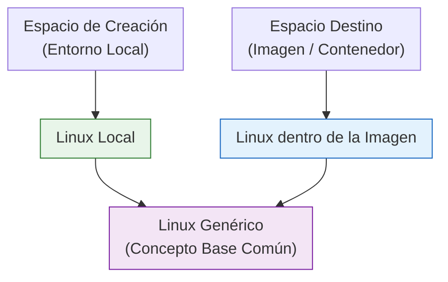

# Contenerización de aplicación java.
## Introducción.
En este punto, crearemos una imagen de nuestra aplicación java. La "contenerizaremos", si es que existe ese verbo.
Lo mejor es decir: "mi aplicación tiene una imagen y se puede usar como contenedor".

 

Crear una imagen es un ejercicio de abstracción. No es complicado: solo requiere tener claro que existen dos espacios diferentes durante el proceso.

El espacio de creación (tu entorno local) y el espacio destino (la imagen o paquete que estás armando).

Ambos tienen un sistema operativo debajo —y no siempre el Linux del destino es el mismo Linux de tu máquina. Esa diferencia suele confundir, pero cuando separas ambos espacios mentalmente, todo se vuelve mucho más sencillo.

Podemos verlo así:
 

Ahora, antes de continuar, validemos que tenemos todo listo.

## Requerimientos

### App java

### Docker

## Docker file

Podemos imaginar al docker file como la gran cocina donde prepararemos nuestra imagen, y donde conviven los dos espacios de trabajo que mencionamos al inicio.

### Instrucciones

| Instrucción    | Propósito | Ejemplo | ¿Cuándo se ejecuta? |
|----------------|-----------|---------|----------------------|
| `FROM`         | Define la imagen base o inicia una nueva etapa. | `FROM alpine:3.18` | **Build-time (una vez)** |
| `ARG`          | Variables disponibles solo durante el build. | `ARG APP_VERSION=1.0` | **Build-time (una vez)** |
| `RUN`          | Ejecuta comandos y crea capas en la imagen. | `RUN apk add --no-cache curl` | **Build-time (una vez)** |
| `CMD`          | Comando por defecto al iniciar el contenedor. | `CMD ["java", "-jar", "app.jar"]` | **Run-time (cada inicio de contenedor)** |
| `LABEL`        | Metadatos de la imagen. | `LABEL maintainer="isaac@marmolus.com"` | **Build-time (una vez)** |
| `MAINTAINER` (obsoleto) | Declaraba autor de la imagen. | `MAINTAINER Isaac` | **Build-time (una vez)** |
| `EXPOSE`       | Documenta puertos que expone la app. | `EXPOSE 8080` | **Build-time (una vez)** |
| `ENV`          | Variables de entorno persistentes. | `ENV JAVA_HOME=/usr/lib/jvm/java-17` | **Build-time (una vez)** *(aplicadas en run-time)* |
| `ADD`          | Copia archivos/URLs/tar. | `ADD app.tar.gz /opt/` | **Build-time (una vez)** |
| `COPY`         | Copia archivos del contexto o de otra etapa. | `COPY target/app.jar /app/` | **Build-time (una vez)** |
| `ENTRYPOINT`   | Define el ejecutable principal del contenedor. | `ENTRYPOINT ["python3"]` | **Run-time (cada inicio de contenedor)** |
| `VOLUME`       | Declara punto de montaje para volúmenes. | `VOLUME ["/data"]` | **Build-time (una vez)** *(efecto en run-time)* |
| `USER`         | Define el usuario para las instrucciones siguientes. | `USER appuser` | **Build-time (una vez)** *(afecta run-time)* |
| `WORKDIR`      | Establece directorio de trabajo. | `WORKDIR /app` | **Build-time (una vez)** |
| `ONBUILD`      | Instrucciones que se ejecutan cuando esta imagen es base de otra. | `ONBUILD COPY . /src` | **Build-time (pero en imágenes “hijas”)** |
| `STOPSIGNAL`   | Señal enviada al detener contenedores. | `STOPSIGNAL SIGTERM` | **Run-time (al detener contenedor)** |
| `HEALTHCHECK`  | Define chequeos de salud del contenedor. | `HEALTHCHECK CMD curl -f http://localhost:8080/health || exit 1` | **Run-time (cíclico mientras el contenedor corre)** |
| `SHELL`        | Cambia la shell por defecto. | `SHELL ["/bin/bash", "-c"]` | **Build-time (una vez)** |

### Tipo de instrucciones

En la tabla anterior, puedes ver en la ultima columna que hay 2 tipos de instrucciones, las que se ejecutan una sola vez y las que se ejecutan en otro momento.

## Nuestra 1a imagen

## Optimizemos

## Version final.
