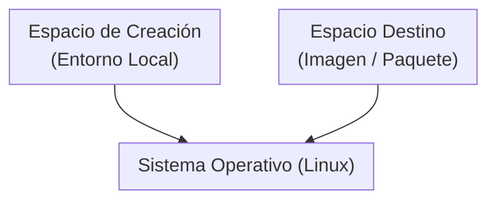
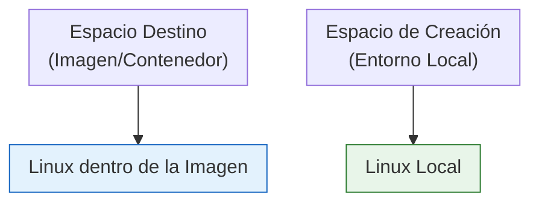

# Contenerización de aplicación java.
## Introducción.
En este punto, crearemos una imagen de nuestra aplicación java. La "contenerizaremos", si es que existe ese verbo.
Lo mejor es decir: "mi aplicación tiene una imagen y se puede usar como contenedor".

Crear una imagen es un ejercicio de abstracción, no es algo complicado, solamente requiere que tengamos claro, mientras creamos la imagen que tenemos 2 espacios, el espacio de creación (nuestro entorno local) y el espacio destino (el paquete que estamos armando). Ambos con un sistema operativo abajo, no siempre el linux del espacio de trabajo destino es el linux local, eso a veces confunde, pero, mientras tengamos separados los espacios en nuestra mente, todo es más sencillo.

Podemos verlo así:

