# Contenerización de aplicación java.
## Introducción.
En este punto, crearemos una imagen de nuestra aplicación java. La "contenerizaremos", si es que existe ese verbo.
Lo mejor es decir: "mi aplicación tiene una imagen y se puede usar como contenedor".

 

Crear una imagen es un ejercicio de abstracción. No es complicado: solo requiere tener claro que existen dos espacios diferentes durante el proceso.

El espacio de creación (tu entorno local) y el espacio destino (la imagen o paquete que estás armando).

Ambos tienen un sistema operativo debajo —y no siempre el Linux del destino es el mismo Linux de tu máquina. Esa diferencia suele confundir, pero cuando separas ambos espacios mentalmente, todo se vuelve mucho más sencillo.


Podemos verlo así:

```mermaid
flowchart TB
    %% Bloque inferior genérico
    subgraph LinuxGenerico["Linux Genérico\n(Concepto Base Común)"]
    end

    %% Bases específicas
    subgraph BaseLocal["Linux Local"]
    end

    subgraph BaseDestino["Linux dentro de la Imagen"]
    end

    %% Espacios
    subgraph Origen["Espacio de Creación\n(Entorno Local)"]
    end

    subgraph Destino["Espacio Destino\n(Imagen / Contenedor)"]
    end

    %% Relaciones
    Origen --> BaseLocal
    Destino --> BaseDestino

    BaseLocal --> LinuxGenerico
    BaseDestino --> LinuxGenerico

    %% Estilos opcionales (colors)
    style LinuxGenerico fill:#f3e5f5,stroke:#7b1fa2
    style BaseLocal fill:#e8f5e9,stroke:#2e7d32
    style BaseDestino fill:#e3f2fd,stroke:#1565c0

```
 



Ahora, antes de continuar, validemos que tenemos todo listo.

## Requerimientos

### App java

### Docker

## Docker file

Podemos imaginar al docker file como la gran cocina donde prepararemos nuestra imagen, y donde conviven los dos espacios de trabajo que mencionamos al inicio.

### Instrucciones

| Instrucción    | Propósito | Ejemplo | ¿Cuándo se ejecuta? |
|----------------|-----------|---------|----------------------|
| `FROM`         | Define la imagen base o inicia una nueva etapa. | `FROM alpine:3.18` | **Build-time (una vez)** |
| `ARG`          | Variables disponibles solo durante el build. | `ARG APP_VERSION=1.0` | **Build-time (una vez)** |
| `RUN`          | Ejecuta comandos y crea capas en la imagen. | `RUN apk add --no-cache curl` | **Build-time (una vez)** |
| `CMD`          | Comando por defecto al iniciar el contenedor. | `CMD ["java", "-jar", "app.jar"]` | **Run-time (cada inicio de contenedor)** |
| `LABEL`        | Metadatos de la imagen. | `LABEL maintainer="isaac@marmolus.com"` | **Build-time (una vez)** |
| `MAINTAINER` (obsoleto) | Declaraba autor de la imagen. | `MAINTAINER Isaac` | **Build-time (una vez)** |
| `EXPOSE`       | Documenta puertos que expone la app. | `EXPOSE 8080` | **Build-time (una vez)** |
| `ENV`          | Variables de entorno persistentes. | `ENV JAVA_HOME=/usr/lib/jvm/java-17` | **Build-time (una vez)** *(aplicadas en run-time)* |
| `ADD`          | Copia archivos/URLs/tar. | `ADD app.tar.gz /opt/` | **Build-time (una vez)** |
| `COPY`         | Copia archivos del contexto o de otra etapa. | `COPY target/app.jar /app/` | **Build-time (una vez)** |
| `ENTRYPOINT`   | Define el ejecutable principal del contenedor. | `ENTRYPOINT ["python3"]` | **Run-time (cada inicio de contenedor)** |
| `VOLUME`       | Declara punto de montaje para volúmenes. | `VOLUME ["/data"]` | **Build-time (una vez)** *(efecto en run-time)* |
| `USER`         | Define el usuario para las instrucciones siguientes. | `USER appuser` | **Build-time (una vez)** *(afecta run-time)* |
| `WORKDIR`      | Establece directorio de trabajo. | `WORKDIR /app` | **Build-time (una vez)** |
| `ONBUILD`      | Instrucciones que se ejecutan cuando esta imagen es base de otra. | `ONBUILD COPY . /src` | **Build-time (pero en imágenes “hijas”)** |
| `STOPSIGNAL`   | Señal enviada al detener contenedores. | `STOPSIGNAL SIGTERM` | **Run-time (al detener contenedor)** |
| `HEALTHCHECK`  | Define chequeos de salud del contenedor. | `HEALTHCHECK CMD curl -f http://localhost:8080/health  exit 1` | **Run-time (cíclico mientras el contenedor corre)** |
| `SHELL`        | Cambia la shell por defecto. | `SHELL ["/bin/bash", "-c"]` | **Build-time (una vez)** |


### Tipo de instrucciones

En la tabla anterior, puedes ver en la ultima columna que hay 2 tipos de instrucciones, las que se ejecutan una sola vez y las que se ejecutan en otro momento.

```mermaid
mindmap
  root((Dockerfile Instructions))
    Build-time
      FROM
      RUN
      COPY
      ADD
      ARG
      WORKDIR
      USER
      LABEL
      EXPOSE
      VOLUME
      SHELL
      ONBUILD
    Run-time
      CMD
      ENTRYPOINT
      HEALTHCHECK
      STOPSIGNAL
    Mixtas (Build → afectan Run)
      ENV
      USER
      WORKDIR
      VOLUME
```



El flujo será


## Nuestra 1a imagen

## Optimizemos
### Fases en un Dockerfile: Build (Builder) y Runtime

La separación entre la fase builder (construcción) y la fase runtime (ejecución) nace de una necesidad práctica: las aplicaciones modernas requieren herramientas pesadas para compilarse —JDK, Node.js completo, Maven, Gradle, Go toolchain— pero no necesitan nada de eso para ejecutarse. Antes de 2016, los Dockerfiles generaban imágenes enormes porque todo se construía y se ejecutaba en la misma imagen. A partir de Docker 17.05 se introdujeron los multi-stage builds, permitiendo crear una primera imagen "builder" que compila el código, y luego copiar únicamente los artefactos resultantes (por ejemplo, el JAR de Spring Boot) a una imagen final mínima —la imagen de runtime— mucho más ligera y segura. Esta separación ayuda a que el Dockerfile refleje de manera clara las dos realidades del software: construir y ejecutar no son la misma cosa.

Usar un builder separado del runtime aporta ventajas significativas: imágenes finales mucho más pequeñas, reducción drástica de superficie de ataque (por ejemplo, imágenes Alpine o distroless), tiempos de despliegue más rápidos, capas más eficientes en caché, y una mayor coherencia entre entornos. Además, promueve buenas prácticas de seguridad: nunca expones herramientas de build en producción. La documentación oficial lo respalda aquí:

🔗 Multi-stage builds — Docker Docs: https://docs.docker.com/build/building/multi-stage/

``` mermaid
flowchart LR
    subgraph Builder["Fase 1: Builder (docker build)"]
        B1(FROM maven:3.9-jdk-17)
        B2(COPY source/)
        B3(RUN mvn clean package)
        B4(OUTPUT: app.jar)
    end

    B4 --> C((Copia artefacto))

    subgraph Runtime["Fase 2: Runtime (docker run)"]
        R1(FROM eclipse-temurin:17-jre)
        R2(COPY app.jar)
        R3(CMD ["java","-jar","app.jar"])
    end

    C --> Runtime
```


## Version final.
