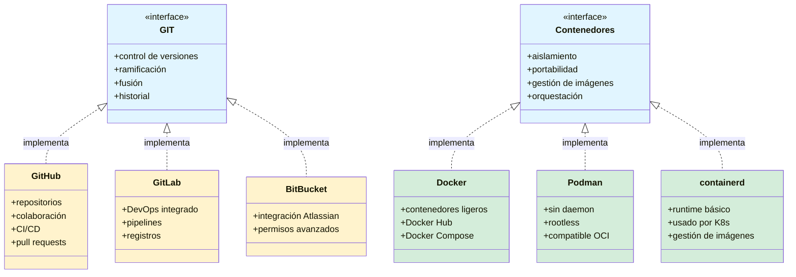
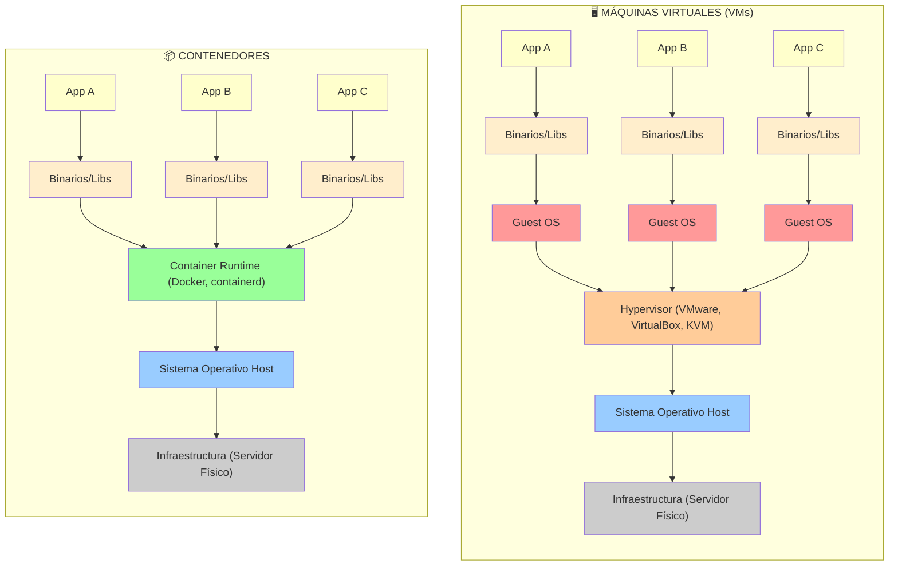

# Docker 101
Hablar de Docker es realmente hablar de contenedores, así somo Github es una servicio que nos permite usar GIT (el sistema distribuido de control de versiones), Docker es una manera de utilizar Contenedores.
Esto quiere decir, que hay otras formas de usar contenedores.

## VM vs Contenedor

