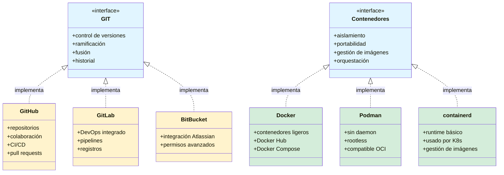
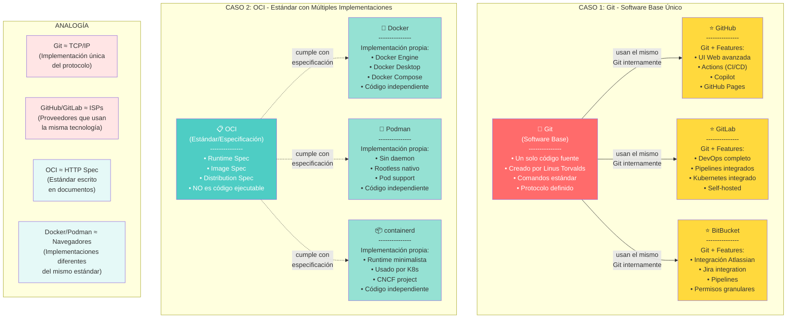
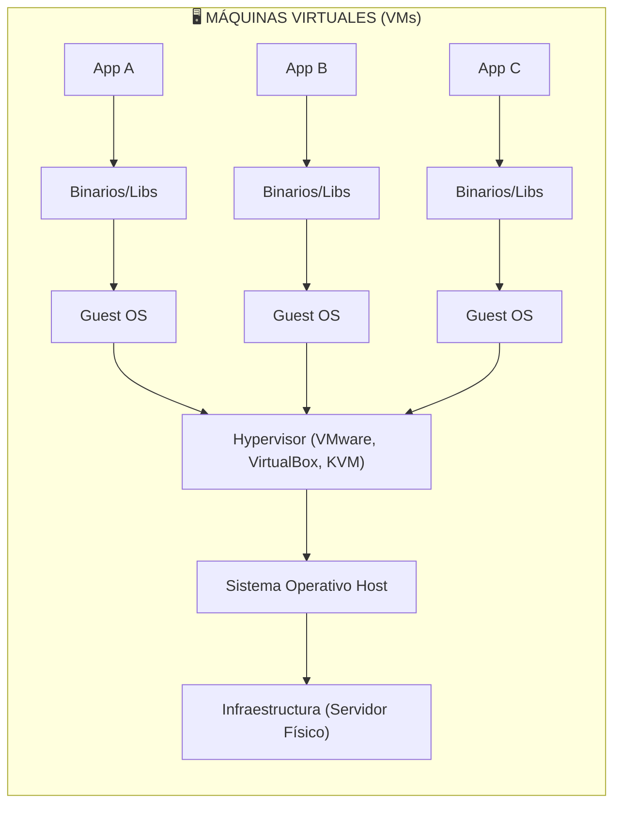
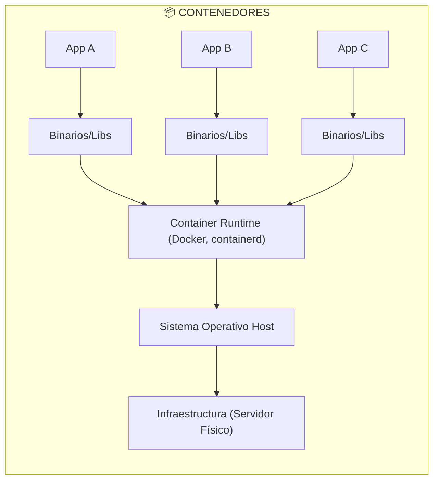
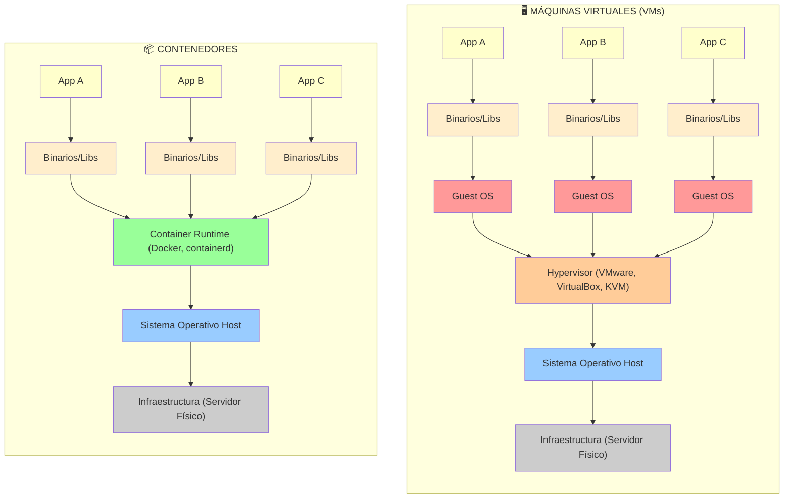
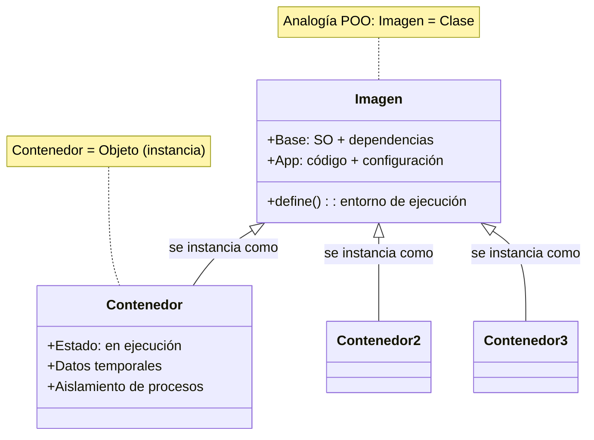

# Docker 101
Hablar de Docker es realmente hablar de contenedores, así como Github es un servicio que nos permite usar GIT (el sistema distribuido de control de versiones), Docker es una manera de utilizar Contenedores.

Esto quiere decir, que hay otras formas de usar contenedores.

En el caso de Git, la compatibilidad se logra ya que todos los que la implementan en realidad son servidores de git con sus respectivos add-ons.

En el caso de los contenedores, hay un estandar subyacente que lo permite, y es : OCI (Open Container Initiative). https://opencontainers.org/

No es necesario conocer el estandar, solo lo menciono para tener claro quien hace la magia, y, si derepente sale algun nuevo actor, tu pregunta como todo un profesional sea: ¿Respeta compleamente el OCI?  ;)

Eso sí, debemos agradecer a Docker pues, ellos dieron parte de su código en el 2015 para que ahora tengamos el estandar y tantas alternativas.

Tenemos claro pues, de que estamos hablando de contenedores.
    

Pero ¿Qué tienen de especial y porqué se usan tanto?
Para contestar esta pregunta, necesitamos primero tener clara la diferencia entre Maquina Virtual y Contenedores.
Así que, vamos a ello.

## VM vs Contenedor
### VM
Iniciemos con las máquinas virtuales (VM).
Cuando usamos una máquina virtual —válgase la redundancia— estamos virtualizando **todo**: desde los fierros (el hardware físico) hasta una capa justo debajo del sistema operativo.

Para lograr esto, requerimos un hypervisor.
El hypervisor es el encargado de abstraer el hardware y crear una capa intermedia que permite que varios sistemas operativos se ejecuten de manera aislada sobre la misma máquina física.
En otras palabras, controla y reparte los recursos (CPU, memoria, disco, red) entre las distintas máquinas virtuales.

¿Te ha pasado que alguna vez intentas crear una VM y tu computadora te dice algo como:

“Ups, aún no has activado la opción que permite usar un hypervisor en esta máquina. Por favor actívala.”
¿Y no lo hacías porque implicaba entrar al BIOS? 😅

En realidad, lo que esa advertencia nos pedía era activar el soporte de virtualización por hardware (Intel VT-x o AMD-V), no instalar un hypervisor.
Esa opción del BIOS permite que el procesador ejecute instrucciones especiales que hacen posible que un hypervisor funcione de forma eficiente y segura.

Una vez activada, ya podemos instalar uno.
VMware, VirtualBox y KVM son ejemplos de hypervisores.
Hoy en día la mayoría de equipos personales ya tienen esta opción activa por defecto, pero hace algunos años era común toparse con ese mensaje.

En resumen:

*Para crear una máquina virtual se requiere un hypervisor, que es quien se encarga de simular el hardware y aislar los sistemas operativos que corren sobre él.*

Teniendo el hypervisor, podemos virtualizar un sistema operativo completo y hacerlo independiente del de nuestra máquina personal.
Así, si nuestro equipo usa Windows, podemos tener una máquina virtual con Linux, o viceversa.

Pero esto tiene un costo: al virtualizar todo el hardware, también necesitamos instalar el sistema operativo completo dentro de la VM para poder usarla.
Después de eso, debemos instalar el software que queremos utilizar (binarios), y las bibliotecas (libs) que se requiere para ejecutar por ejemplo una aplicación (App A)

Al final tendríamos algo como:

Por eso las máquinas virtuales suelen ser tan pesadas: 5 GB, 10 GB o incluso más.
Usar una VM tiene sentido cuando queremos ejecutar una aplicación de Windows en una máquina Linux, o a la inversa.

### Contenedores
¿Y un contenedor?

Aquí es donde entra la gran pregunta:

¿Por qué tengo una *ballena* viviendo dentro de mi computadora si lo que quiero es virtualizar una app en Linux, y mi máquina ya es Linux?

Justamente para eso existen los contenedores.
Si lo que necesitamos “virtualizar” no es todo un sistema operativo, sino una sola aplicación (App A), basta con aislar su propio entorno:

* Su software
* Sus binarios
* Las bibliotecas que utiliza

Todo lo demás —hardware y sistema operativo— ya existen en el host, por lo tanto no necesitamos volver a empaquetarlos.
Esa es la clave: los contenedores aprovechan el sistema operativo existente y solo aíslan lo estrictamente necesario para que la aplicación funcione igual, sin importar dónde se ejecute.

Ahora sería algo así:

### Comparación

Entonces, para los contenedores, solo requerimos un "Container Runtime" todo lo demás lo da nuestra maquina host, nos ahorramos: el hypervisor y el SO Guest.
Nos ahorramos las partes más costosas, por eso es que son tan ligeros.

¿Queda más claro ahora cierto?

## Docker
Docker es el "Container Runtime" más popular y es el que usaremos en estos laboratorios, no es el único, eso ya debes tenerlo claro, pero sí es el más popular y difundido; es * la norma de facto* dirían los libros.

### Instalación.
Idealmente, docker se utiliza en máquinas linux, pero, nada nos impide usarlo en Windows.
No revisaremos la instalación, hay muchas guías en internet que te llevan literalmente de la mano, para poder instalar docker, así que asumiremos que ya lo tienes instalado.

### Validación.
Algo que haremos mucho en estos laboratorios es agregar un paso para validar, esto nos ayudará a saber que vamos bien o si es necesario revisar y repetir algun paso.
¿Cómo saber si tengo ya listo docker en mi maquina personal?

#### Revisa la versión.

### Imagen y contenedor
Antes de pasar al siguiente paso, es importante que tengamos clara la diferencia entre IMAGEN y CONTENEDOR.

Una Imagen es la plantilla para generar un contenedor, podemos verlo así: Un contenedor es una imagen en ejecución, y, puedo generar muchos contenedores de la misma plantilla. Haciendo una analogía con la POO: "La imagen es la clase, los contenedores son las instancias de esa clase

En resumen:

* La imagen (Image) define la estructura, dependencias y comportamiento → como una clase.
* El contenedor (Container) es una instancia viva y aislada de esa definición → como un objeto en ejecución.
* Puedes crear muchas instancias (contenedores) a partir de una sola clase (imagen).
  

Docker tiene un repositorio de imágenes, no de contenedores, nosotros descargamos la imagen en nuestra maquina personal, y la ejecutamos, al ejecutarla tenemos un contenedor.
Sencillo.

#### Ejecuta un par de comandos
Entonces, para tener un contenedor, primero debemos tener su imagen.

Ejecutemos:

#### Ejecuta un contenedor
Listo, tenemos ya la imagen, ahora sí, ejecutemos un contenedor, tambien acá hay : "Hola Mundo"

### Todo ok

### Ejemplo práctico
#### Ngnix.

#### Otros comandos útiles

## Crear imágenes

Si bien el hecho de tener acceso a un repositorio con muchas imágenes es una gran ventaja para agilizar el desarrollo, El verdadero potencial de los contenedores es que podemos crear nuestras propias imágenes.
Pero, eso lo veremos de manera práctica en la siguiente parte de este laboratorio:
* Crear una imagen de una app java.

Regresa al indice y continua con el siguiente paso.
