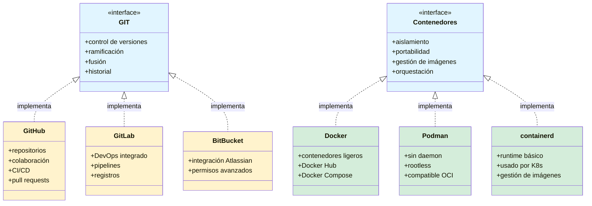
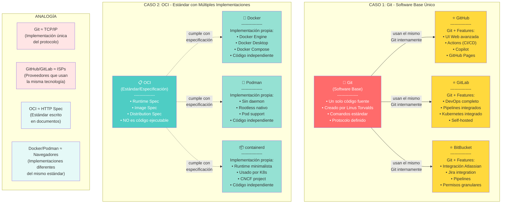
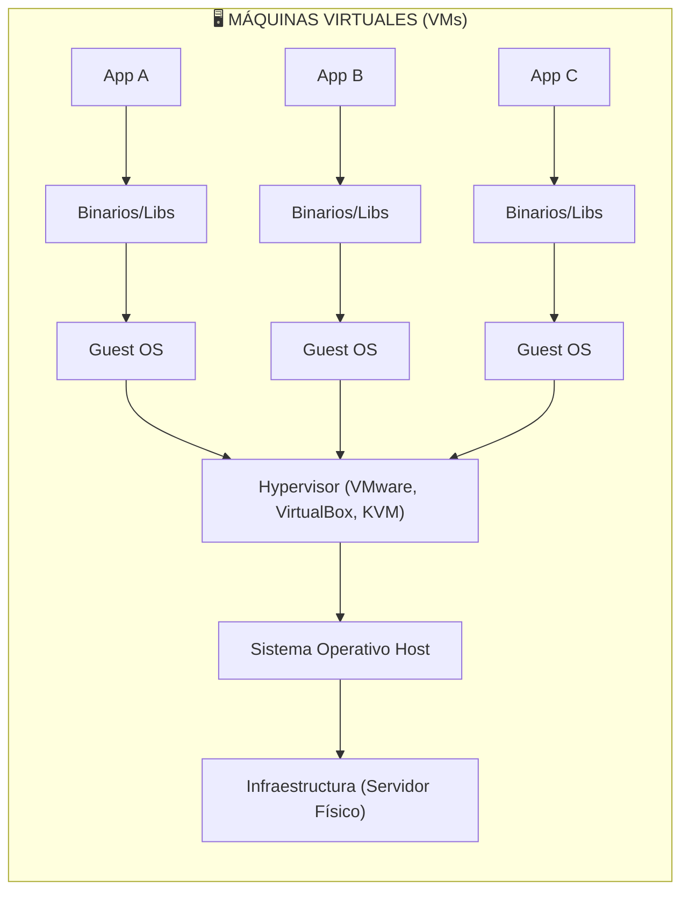
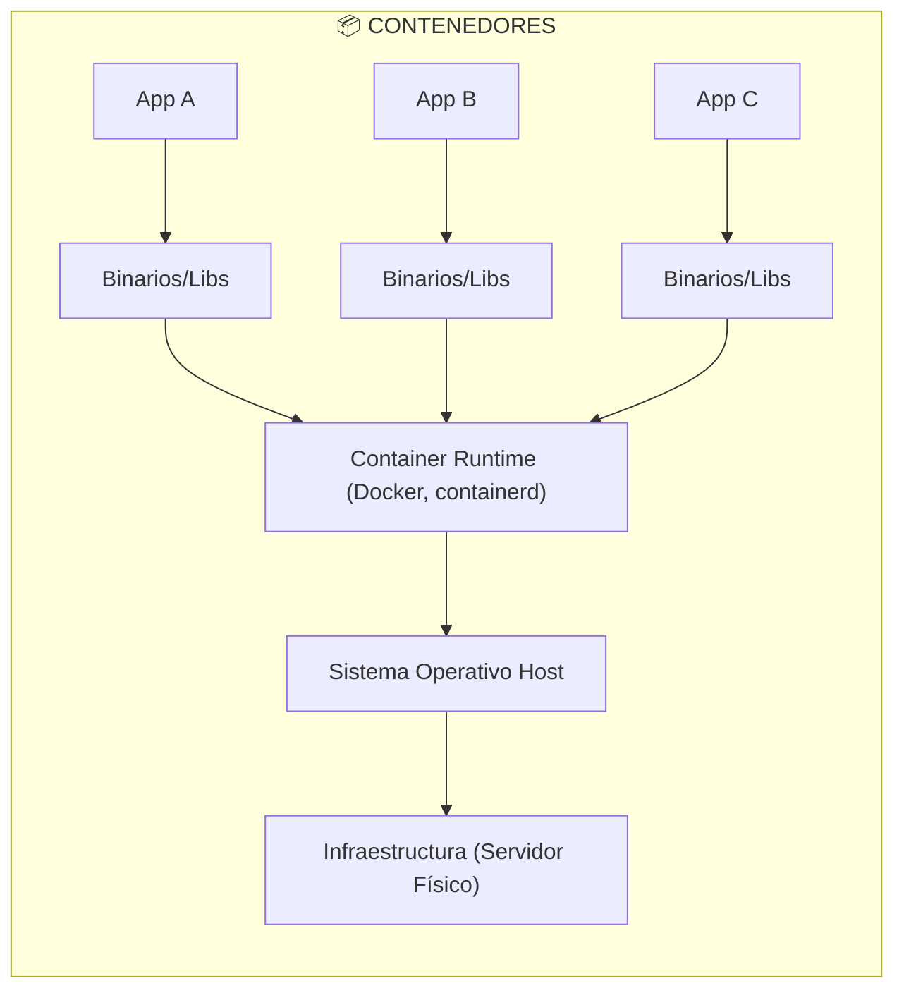
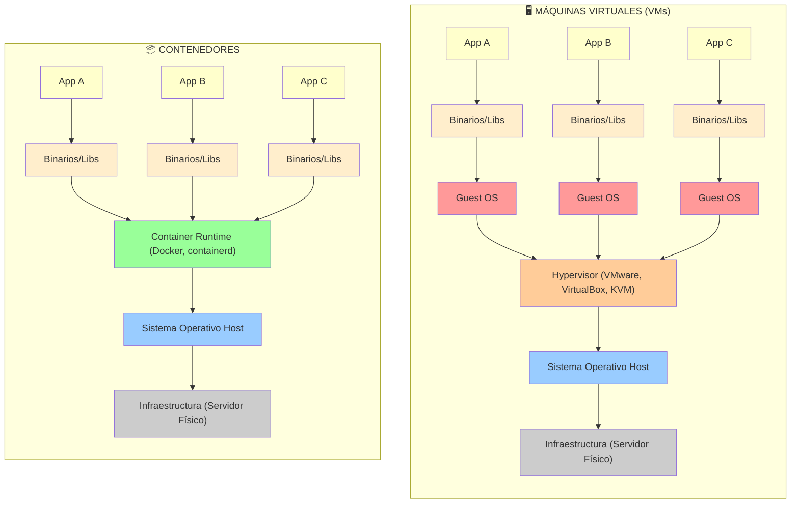
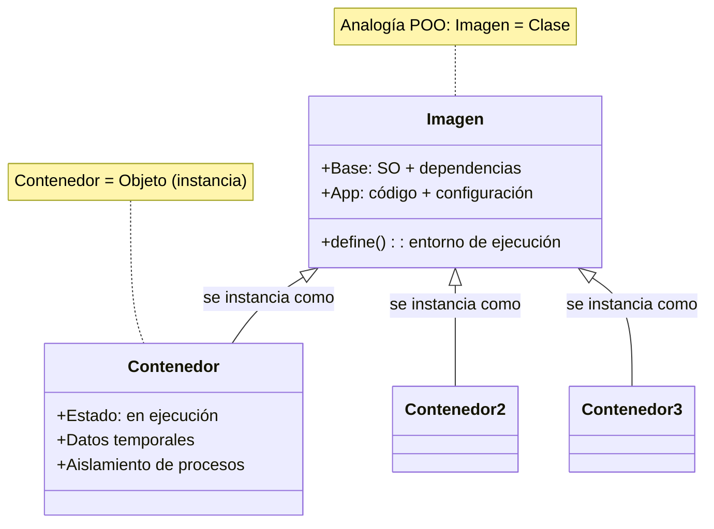
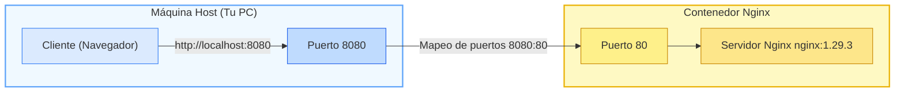

# Docker 101
Hablar de Docker es realmente hablar de contenedores, así como Github es un servicio que nos permite usar GIT (el sistema distribuido de control de versiones), Docker es una manera de utilizar Contenedores.


Esto quiere decir, que hay otras formas de usar contenedores.



En el caso de Git, la compatibilidad se logra ya que todos los que la implementan en realidad son servidores de git con sus respectivos add-ons.


En el caso de los contenedores, hay un estandar subyacente que lo permite, y es : OCI (Open Container Initiative). https://opencontainers.org/

No es necesario conocer el estandar, solo lo menciono para tener claro quien hace la magia, y, si derepente sale algun nuevo actor, tu pregunta como todo un profesional sea: ¿Respeta compleamente el OCI?  ;)


Eso sí, debemos agradecer a Docker pues, ellos dieron parte de su código en el 2015 para que ahora tengamos el estandar y tantas alternativas.




Pero ¿Qué tienen de especial los contenedores y porqué se usan tanto?
Para contestar esta pregunta, necesitamos primero tener clara la diferencia entre Maquina Virtual y Contenedores.
Así que, vamos a ello.

## VM vs Contenedor
### VM
Iniciemos con las máquinas virtuales (VM).
Cuando usamos una máquina virtual —válgase la redundancia— estamos virtualizando **todo**: desde los fierros (el hardware físico) hasta una capa justo debajo del sistema operativo.

Para lograr esto, requerimos un hypervisor.
El hypervisor es el encargado de abstraer el hardware y crear una capa intermedia que permite que varios sistemas operativos se ejecuten de manera aislada sobre la misma máquina física.
En otras palabras, controla y reparte los recursos (CPU, memoria, disco, red) entre las distintas máquinas virtuales.

¿Te ha pasado que alguna vez intentas crear una VM y tu computadora te dice algo como:

“Ups, aún no has activado la opción que permite usar un hypervisor en esta máquina. Por favor actívala.”
¿Y no lo hacías porque implicaba entrar al BIOS? 😅

En realidad, lo que esa advertencia nos pedía era activar el soporte de virtualización por hardware (Intel VT-x o AMD-V), no instalar un hypervisor.
Esa opción del BIOS permite que el procesador ejecute instrucciones especiales que hacen posible que un hypervisor funcione de forma eficiente y segura.

Una vez activada, ya podemos instalar uno.
VMware, VirtualBox y KVM son ejemplos de hypervisores.
Hoy en día la mayoría de equipos personales ya tienen esta opción activa por defecto, pero hace algunos años era común toparse con ese mensaje.

En resumen:

*Para crear una máquina virtual se requiere un hypervisor, que es quien se encarga de simular el hardware y aislar los sistemas operativos que corren sobre él.*

Teniendo el hypervisor, podemos virtualizar un sistema operativo completo y hacerlo independiente del de nuestra máquina personal.
Así, si nuestro equipo usa Windows, podemos tener una máquina virtual con Linux, o viceversa.

Pero esto tiene un costo: al virtualizar todo el hardware, también necesitamos instalar el sistema operativo completo dentro de la VM para poder usarla.
Después de eso, debemos instalar el software que queremos utilizar (binarios), y las bibliotecas (libs) que se requiere para ejecutar por ejemplo una aplicación (App A)

Al final tendríamos algo como:


Por eso las máquinas virtuales suelen ser tan pesadas: 5 GB, 10 GB o incluso más.
Usar una VM tiene sentido cuando queremos ejecutar una aplicación de Windows en una máquina Linux, o a la inversa.

### Contenedores
¿Y un contenedor?

Aquí es donde entra la gran pregunta:

¿Por qué tengo una *ballena* viviendo dentro de mi computadora si lo que quiero es virtualizar una app en Linux, y mi máquina ya es Linux?

Justamente para eso existen los contenedores.
Si lo que necesitamos “virtualizar” no es todo un sistema operativo, sino una sola aplicación (App A), basta con aislar su propio entorno:

* Su software
* Sus binarios
* Las bibliotecas que utiliza
* Puertos que utiliza e incluso las redes que utiliza (esto tiene sus bemoles, pero, podemos por el momento abstraerlo así)

Todo lo demás —hardware y sistema operativo— ya existen en el host, por lo tanto no necesitamos volver a empaquetarlos.
Esa es la clave: los contenedores aprovechan el sistema operativo existente y solo aíslan lo estrictamente necesario para que la aplicación funcione igual, sin importar dónde se ejecute.

Ahora sería algo así:




### Comparación

Entonces, para los contenedores, solo requerimos un "Container Runtime" todo lo demás lo da nuestra maquina host, nos ahorramos: el hypervisor y el SO Guest.
Nos ahorramos las partes más costosas, por eso es que son tan ligeros.

¿Queda más claro ahora cierto?




## Docker
Docker es el "Container Runtime" más popular y es el que usaremos en estos laboratorios, no es el único, eso ya debes tenerlo claro, pero sí es el más popular y difundido; es _la norma de facto_ dirían los libros.

### Instalación.
Idealmente, docker se utiliza en máquinas linux, pero, nada nos impide usarlo en Windows.
No revisaremos la instalación, hay muchas guías en internet que te llevan literalmente de la mano, para poder instalar docker, así que asumiremos que ya lo tienes instalado.

Estos 2 videos están muy completos y detallados:
* Windows: [https://www.youtube.com/watch?v=AxBQFrHK35c](https://www.youtube.com/watch?v=AxBQFrHK35c)
* Linux: [https://www.youtube.com/watch?v=SROEpSKCoBQ](https://www.youtube.com/watch?v=SROEpSKCoBQ)

### Validación.
Algo que haremos mucho en estos laboratorios es agregar un paso para validar, esto nos ayudará a saber que vamos bien o si es necesario revisar y repetir algun paso.
¿Cómo saber si tengo ya listo docker en mi maquina personal?

#### Revisa la versión.


```bash
[rugi@bigoze ~]$ docker version
Client: Docker Engine - Community
 Version:           28.5.0
 API version:       1.51
 Go version:        go1.24.7
 Git commit:        887030f
 Built:             Thu Oct  2 14:57:16 2025
 OS/Arch:           linux/amd64
 Context:           default

Server: Docker Engine - Community
 Engine:
  Version:          28.5.0
  API version:      1.51 (minimum version 1.24)
  Go version:       go1.24.7
  Git commit:       cd04830
  Built:            Thu Oct  2 14:54:15 2025
  OS/Arch:          linux/amd64
  Experimental:     false
 containerd:
  Version:          v1.7.28
  GitCommit:        b98a3aace656320842a23f4a392a33f46af97866
 runc:
  Version:          1.3.0
  GitCommit:        v1.3.0-0-g4ca628d1
 docker-init:
  Version:          0.19.0
  GitCommit:        de40ad0
```

### Imagen y contenedor
Antes de pasar al siguiente paso, es importante que tengamos clara la diferencia entre IMAGEN y CONTENEDOR.

Una Imagen(`image`) es la plantilla para generar un contenedor(`container`), podemos verlo así: Un contenedor es una imagen en ejecución, y, puedo generar muchos contenedores de la misma plantilla. Haciendo una analogía con la POO: _"La imagen es la clase, los contenedores son las instancias de esa clase"_

En resumen:

* La imagen (`image`) define la estructura, dependencias y comportamiento → como una clase.
* El contenedor (`container`) es una instancia viva y aislada de esa definición → como un objeto en ejecución.
* Puedes crear muchas instancias (contenedores) a partir de una sola clase (imagen).
  


Docker tiene un repositorio de imágenes, no de contenedores, nosotros descargamos la imagen en nuestra maquina personal, y la ejecutamos, al ejecutarla tenemos un contenedor.
Sencillo.

#### Ejecuta un par de comandos
Entonces, para tener un contenedor, primero debemos tener su imagen.

Entonces, lo primero que debemos de hacer es saber cuáles imágenes tengo localmente.

Para ello debemos ejecuar la siguiente linea,
como sugerencia, crea un archivo de notas, con estos comandos, serán tu dìa a día con Docker:

##### Listar imágenes disponbles

Ejecutemos:
```console
docker images
```

Ejemplo de salida:
```console
D:\code\github\otel2\OTEL_Parte2\Fase01\final [main ≡]> docker images
REPOSITORY                                    TAG       IMAGE ID       CREATED         SIZE
neondatabase/neon_local                       v1        8e8892d2a674   6 weeks ago     475MB
postgres                                      latest    ca95f67ffb26   2 months ago    454MB
docker.swagger.io/swaggerapi/swagger-editor   latest    aa4c8592eb3c   6 months ago    72.1MB
ghcr.io/lftraining/lfs148-code-application    latest    e7005de3daa5   12 months ago   1.31GB
grafana/grafana                               10.4.1    ccb72d0beb64   19 months ago   430MB
grafana/loki                                  2.9.4     652b79950756   21 months ago   74.6MB
grafana/promtail                              2.9.4     1c7475004f2f   21 months ago   198MB
otel/opentelemetry-collector-contrib          0.86.0    ad8763aae071   2 years ago     221MB
jaegertracing/all-in-one                      1.49      14a189507962   2 years ago     59.3MB
```

Si acabas de instalar docker, verás una lista vacía.

Ahora te debes estar preguntando, ¿Y para ver la lista de contenedores?
##### Listar contenedores disponibles
Para mostrar la lista de contenedores, ejecuta:
```console
docker container ls
```

Un ejemplo de salida:
```console
D:\code\github\otel2\OTEL_Parte2\Fase01\final [main ≡]> docker container ls
CONTAINER ID   IMAGE     COMMAND   CREATED   STATUS    PORTS     NAMES
```
¡¡Vamos bien!!

#### Ejecuta un contenedor
Pasemos al siguiente movimiento, pongamos en marcha un contenedor.
Para no perder la costumbre, tambien tenemos un contenedor "Hola Mundo".

Todas las imágenes que no sean creadas por nosotros (sí, también podemos crear imágenes y, es el verdadero potencial de los contenedores), deben vivir en un repositorio.
A estos repositorios se les llama:registro de contenedores (`container registry` en inglés), agrega esto a tu vocabulario para este tema, es algo que debes tener presente siempre.
Docker tiene un `container registry` público, desde ahi se descargan la mayoría de imágenes, pero, no es el único, conforme uses de manera profesional los contenedores, descubrirás que hay `container registry` privados.

AWS, RedHat, Oracle, Azure, todos ellos tienen `container registry` pero, por ahora te sirve saber que usaremos el `container registry` público de Docker.
Y digo `container registry` público ya que también los hay privados, ahi requerirás usuario y password.

Ok, regresando a nuestro objetivo inmediato. Ejecutemos nuestro "Hola mundo" en contenedores.

Lo siguiente que debemos saber es que, toda imagen tiene un nombre y un tag, acostumbrate a decir tag y no versión, tiene más sentido (después descubrirás porqué).
Cada que usemos una imagen, debemos acostumbrar a decir cual tag estamos usando de esa imagen, eso es para ubicar la imagen precisa que se utiliza.


Conforme pasa el tiempo, las imagenes van mejorando o van teniendo cambios y, van saliendo más tags, a veces el tag es numerico, y nos ayuda para poder darle la equivalencia de "versión", pero
no siempre es asì, por ello, como mencionaba, procura mejor decir: estoy usando la imagen X, con el tag Y.

Si no se especifica el tag, existe un tag por default, llamado: `latest` muy util para pruebs rápidas o para probar que hay de nuevo, pero, no lo uses en ambientes productivos.
El  `latest` de hoy, no será el mismo  `latest` dentro de un mes.

Continuemos:
Este es el `container registry` público de Docker.
[https://hub.docker.com/](https://hub.docker.com/)


Y, esta es la imagen que vamos a ejecutar:
[https://hub.docker.com/_/hello-world/](https://hub.docker.com/_/hello-world/)


Puede ver que tiene un montón de tags, y por ahi verás el tag `latest`.


Para poner en marcha un contenedor, solo debemos hacer lo siguiente:

`docker run [OPTIONS] IMAGE [COMMAND] [ARG...]`

Para nuestro ejercicio, será:

`docker run hello-world`

No estamos especificando el tag, asì que, estamos realmente usando la imagen hello-world con el tag: latest.

Ejemplo de salida.
```console
D:\code\github\otel2\OTEL_Parte2\Fase01\final [main ≡]> docker run hello-world

Hello from Docker!
This message shows that your installation appears to be working correctly.

To generate this message, Docker took the following steps:
 1. The Docker client contacted the Docker daemon.
 2. The Docker daemon pulled the "hello-world" image from the Docker Hub.
    (amd64)
 3. The Docker daemon created a new container from that image which runs the
    executable that produces the output you are currently reading.
 4. The Docker daemon streamed that output to the Docker client, which sent it
    to your terminal.

To try something more ambitious, you can run an Ubuntu container with:
 $ docker run -it ubuntu bash

Share images, automate workflows, and more with a free Docker ID:
 https://hub.docker.com/

For more examples and ideas, visit:
 https://docs.docker.com/get-started/
```

Con este contenedor podemos casi garantizar que tu instalación de Docker está completamente funcional.
Si no has obtenido esa salida, revisa el error y repite el proceso de instalación.

### Todo ok
Si sí obtuviste el resultado mostrado, felicitaciones, estás listo para continuar.

hello-world es un contendor sencillo, solo muestra información, no trae nada màs empaquetado y; muestra un mensaje y se termina, es decir, 
termina su ejecución después de mostrar el mensaje.

Asì, si vuelves a ejecutar:

```console
D:\code\github\otel2\OTEL_Parte2\Fase01\final [main ≡]> docker container ls
CONTAINER ID   IMAGE     COMMAND   CREATED   STATUS    PORTS     NAMES
```

Seguirás viendo vacía la lista, ya que nuestro contenedor ya se terminó de ejecutar.

### Ejemplo práctico
Pasemos ahora a ver algo más práctico, probemos la imagen de ngnix

#### Ngnix.
La imagen de ngnix en el CR de Docker es esta:
[https://hub.docker.com/_/nginx](https://hub.docker.com/_/nginx)

Usaremos el tag: 1.29.3

Esta es la línea que ejecutaremos:
 `docker run -d -p 8080:80 nginx:1.29.3`

 | Parámetro | Detalle |
|------------|----------|
| `docker run` | Inicia un nuevo contenedor a partir de una imagen. |
| `-d` | Ejecuta el contenedor en modo **detached** (en segundo plano). |
| `-p 8080:80` | Mapea el **puerto 8080** del host al **puerto 80** del contenedor. Es decir, podrás acceder al servicio en `http://localhost:8080`. |
| `nginx:1.29.3` | Especifica la **imagen** y la **etiqueta (versión)** que se usará. En este caso, la versión 1.29.3 de Nginx. |

Quizá lo que más te llame la atenciòn es el parametro -p, es sencillo de interpretar, es un mapeo de puertos entre nuestra maquina y el contenedor.
primero va nuestro puerto, luego el del contenedor, es decir, lo que el contenedor mapèe en el puerto 80 (del contenedor), mapealo al puerto 8080 de mi maquina.




Interpretación:
* 8080 → puerto del host, es decir, el que usas en el navegador.
* 80 → puerto interno del contenedor, donde escucha Nginx.
* El tráfico HTTP se redirige automáticamente gracias al parámetro -p.


Viendo todo en acción es mas sencillo.
```console
%> docker run -d -p 8080:80 nginx:1.29.3
Unable to find image 'nginx:1.29.3' locally
1.29.3: Pulling from library/nginx
d7ecded7702a: Pull complete
266626526d42: Pull complete
320b0949be89: Pull complete
d921c57c6a81: Pull complete
9def903993e4: Pull complete
52bc359bcbd7: Pull complete
e2f8e296d9df: Pull complete
Digest: sha256:1beed3ca46acebe9d3fb62e9067f03d05d5bfa97a00f30938a0a3580563272ad
Status: Downloaded newer image for nginx:1.29.3
3c42feb7c36f897cf8cbc9b9e22fab6a4b22c16df774d51a10dd475da781a2b2
```

 Observa como, al no tener la imagen localmente, primero se descarga.

 Ahora sí, si ejecutas:
```console 
%> docker container ls
CONTAINER ID   IMAGE          COMMAND                  CREATED         STATUS         PORTS                  NAMES
3c42feb7c36f   nginx:1.29.3   "/docker-entrypoint.…"   8 minutes ago   Up 8 minutes   0.0.0.0:8080->80/tcp   clever_pasteur
D:\code\github\otel2\OTEL_Parte2\Fase01\final [main ≡]>
```
Verás que hay un contenedor vivo.

Abre tu navegador en el puerto 8080, deberás ver algo como esto:


Felicitaciones, has ejecutado tu primer contenedor.

#### Otros comandos útiles
Algunos otros comandos que debes conocer son:
`docker stop _container_id_`

Deten el contenedor de ngnix, primero listamos los contenedores disponibles, vemos su containerid, y con ese valor, podemos detenerlo.

```console 
%> docker container ls
CONTAINER ID   IMAGE          COMMAND                  CREATED          STATUS          PORTS                  NAMES
3c42feb7c36f   nginx:1.29.3   "/docker-entrypoint.…"   15 minutes ago   Up 15 minutes   0.0.0.0:8080->80/tcp   clever_pasteur

%> docker stop 3c42feb7c36f
3c42feb7c36f
```
Para efectos de estos laboratorios, puedes consultar más comandos de docker aquí:
[../../../ext/lab-operaciones-extendido.md](../../../ext/lab-operaciones-extendido.md)

## Crear imágenes

Si bien el hecho de tener acceso a un CR con muchas imágenes es una gran ventaja para agilizar el desarrollo, el verdadero potencial de los contenedores es que podemos crear nuestras propias imágenes.

Pero, eso lo veremos de manera práctica en la siguiente parte de este laboratorio:
* Crear una imagen de una app java.

Regresa al <a href="../Readme.md">indice</a> y continua con el siguiente paso.
