# Docker 101
Hablar de Docker es realmente hablar de contenedores, así como Github es un servicio que nos permite usar GIT (el sistema distribuido de control de versiones), Docker es una manera de utilizar Contenedores.

Esto quiere decir, que hay otras formas de usar contenedores.

```mermaid
classDiagram
    class GIT {
        <<interface>>
        +control de versiones
        +ramificación
        +fusión
        +historial
    }
    
    class Contenedores {
        <<interface>>
        +aislamiento
        +portabilidad
        +gestión de imágenes
        +orquestación
    }
    
    class GitHub {
        +repositorios
        +colaboración
        +CI/CD
        +pull requests
    }
    
    class GitLab {
        +DevOps integrado
        +pipelines
        +registros
    }
    
    class BitBucket {
        +integración Atlassian
        +permisos avanzados
    }
    
    class Docker {
        +contenedores ligeros
        +Docker Hub
        +Docker Compose
    }
    
    class Podman {
        +sin daemon
        +rootless
        +compatible OCI
    }
    
    class containerd {
        +runtime básico
        +usado por K8s
        +gestión de imágenes
    }
    
    GIT <|.. GitHub : implementa
    GIT <|.. GitLab : implementa
    GIT <|.. BitBucket : implementa
    
    Contenedores <|.. Docker : implementa
    Contenedores <|.. Podman : implementa
    Contenedores <|.. containerd : implementa
    
    style GIT fill:#e1f5ff
    style Contenedores fill:#e1f5ff
    style GitHub fill:#fff3cd
    style GitLab fill:#fff3cd
    style BitBucket fill:#fff3cd
    style Docker fill:#d4edda
    style Podman fill:#d4edda
    style containerd fill:#d4edda
```

En el caso de Git, la compatibilidad se logra ya que todos los que la implementan en realidad son servidores de git con sus respectivos add-ons.

En el caso de los contenedores, hay un estandar subyacente que lo permite, y es : OCI (Open Container Initiative). https://opencontainers.org/

No es necesario conocer el estandar, solo lo menciono para tener claro quien hace la magia, y, si derepente sale algun nuevo actor, tu pregunta como todo un profesional sea: ¿Respeta compleamente el OCI?  ;)

Eso sí, debemos agradecer a Docker pues, ellos dieron parte de su código en el 2015 para que ahora tengamos el estandar y tantas alternativas.

```mermaid
graph TB
    subgraph "CASO 1: Git - Software Base Único"
        Git["🔧 Git<br/>(Software Base)<br/>---------------<br/>• Un solo código fuente<br/>• Creado por Linus Torvalds<br/>• Comandos estándar<br/>• Protocolo definido"]
        
        GitHub["⭐ GitHub<br/>---------------<br/>Git + Features:<br/>• UI Web avanzada<br/>• Actions (CI/CD)<br/>• Copilot<br/>• GitHub Pages"]
        
        GitLab["⭐ GitLab<br/>---------------<br/>Git + Features:<br/>• DevOps completo<br/>• Pipelines integrados<br/>• Kubernetes integrado<br/>• Self-hosted"]
        
        BitBucket["⭐ BitBucket<br/>---------------<br/>Git + Features:<br/>• Integración Atlassian<br/>• Jira integration<br/>• Pipelines<br/>• Permisos granulares"]
        
        Git -->|"usan el mismo<br/>Git internamente"| GitHub
        Git -->|"usan el mismo<br/>Git internamente"| GitLab
        Git -->|"usan el mismo<br/>Git internamente"| BitBucket
    end
    
    subgraph "CASO 2: OCI - Estándar con Múltiples Implementaciones"
        OCI["📋 OCI<br/>(Estándar/Especificación)<br/>---------------<br/>• Runtime Spec<br/>• Image Spec<br/>• Distribution Spec<br/>• NO es código ejecutable"]
        
        Docker["🐳 Docker<br/>---------------<br/>Implementación propia:<br/>• Docker Engine<br/>• Docker Desktop<br/>• Docker Compose<br/>• Código independiente"]
        
        Podman["🦭 Podman<br/>---------------<br/>Implementación propia:<br/>• Sin daemon<br/>• Rootless nativo<br/>• Pod support<br/>• Código independiente"]
        
        Containerd["📦 containerd<br/>---------------<br/>Implementación propia:<br/>• Runtime minimalista<br/>• Usado por K8s<br/>• CNCF project<br/>• Código independiente"]
        
        OCI -.->|"cumple con<br/>especificación"| Docker
        OCI -.->|"cumple con<br/>especificación"| Podman
        OCI -.->|"cumple con<br/>especificación"| Containerd
    end
    
    subgraph "ANALOGÍA"
        A1["Git ≈ TCP/IP<br/>(Implementación única<br/>del protocolo)"]
        A2["GitHub/GitLab ≈ ISPs<br/>(Proveedores que usan<br/>la misma tecnología)"]
        A3["OCI ≈ HTTP Spec<br/>(Estándar escrito<br/>en documentos)"]
        A4["Docker/Podman ≈ Navegadores<br/>(Implementaciones diferentes<br/>del mismo estándar)"]
    end
    
    style Git fill:#ff6b6b,color:#fff
    style OCI fill:#4ecdc4,color:#fff
    style GitHub fill:#ffd93d
    style GitLab fill:#ffd93d
    style BitBucket fill:#ffd93d
    style Docker fill:#95e1d3
    style Podman fill:#95e1d3
    style Containerd fill:#95e1d3
    style A1 fill:#ffe5e5
    style A2 fill:#ffe5e5
    style A3 fill:#e5f9f7
    style A4 fill:#e5f9f7
```

Tenemos claro pues, de que estamos hablando de contenedores.
    

Pero ¿Qué tienen de especial y porqué se usan tanto?
Para contestar esta pregunta, necesitamos primero tener clara la diferencia entre Maquina Virtual y Contenedores.
Así que, vamos a ello.

## VM vs Contenedor
Iniciemos con las máquinas virtuales(VM), cuando usamos una maquina virtual, válgase la redundancia, estamos virtualizando **todo**, es decir, estamos "creando" todo desde los fierros hasta lo que sería una *Layer* abajito del sistema operarivo, para lograr esto, requerimos un: hypervisor.
El hypervisor es el encargado de abstrar el hardware y esta *Layer* encimita de los fierros.

¿Te ha pasado que alguna vez quieres crear una VM y tu máquina te dice "ups, aun has activado el hypervisor, por favor activalo."?
Para eso se requiere el hypervisor.

Dadas las características de las máquinas actuales, ya es raro que alguna máquina personal no tenga activado su hypervisor, hace años era común que te toparas con este problema

Teniendo el hypervisor, entonces, ya se puede virtualizar un sistema operativo deseado, y éste puede ser distinto al de nuestra máquina personal.
Así, si nuestra maquina es windows, podemos tener una máquina virtual que tenga linux, y a la inversa.

Pero, esto tiene un costo, dado que el hypervisor somo abstrae el hardware y un poquito más, requerimos el sistema operativo completo, y, si lo que queremos virtualizar es una aplicación, faltaría el software de esa aplicación más las bibliotecas que usa, tendreoms algo como esto:

```mermaid
graph TB
    subgraph VM["🖥️ MÁQUINAS VIRTUALES (VMs)"]
        direction TB
        VM_App1["App A"]
        VM_App2["App B"]
        VM_App3["App C"]
        VM_Bins1["Binarios/Libs"]
        VM_Bins2["Binarios/Libs"]
        VM_Bins3["Binarios/Libs"]
        VM_OS1["Guest OS"]
        VM_OS2["Guest OS"]
        VM_OS3["Guest OS"]
        VM_Hypervisor["Hypervisor (VMware, VirtualBox, KVM)"]
        VM_HostOS["Sistema Operativo Host"]
        VM_Infrastructure["Infraestructura (Servidor Físico)"]
        
        VM_App1 --> VM_Bins1
        VM_App2 --> VM_Bins2
        VM_App3 --> VM_Bins3
        VM_Bins1 --> VM_OS1
        VM_Bins2 --> VM_OS2
        VM_Bins3 --> VM_OS3
        VM_OS1 --> VM_Hypervisor
        VM_OS2 --> VM_Hypervisor
        VM_OS3 --> VM_Hypervisor
        VM_Hypervisor --> VM_HostOS
        VM_HostOS --> VM_Infrastructure
    end
     
    style VM_OS1 fill:#ff9999
    style VM_OS2 fill:#ff9999
    style VM_OS3 fill:#ff9999
    style VM_Hypervisor fill:#ffcc99
    style VM_HostOS fill:#99ccff
    style VM_Infrastructure fill:#cccccc
    
    style C_Runtime fill:#99ff99
    style C_HostOS fill:#99ccff
    style C_Infrastructure fill:#cccccc
    
    style VM_App1 fill:#ffffcc
    style VM_App2 fill:#ffffcc
    style VM_App3 fill:#ffffcc
    style VM_Bins1 fill:#ffeecc
    style VM_Bins2 fill:#ffeecc
    style VM_Bins3 fill:#ffeecc
    
    style C_App1 fill:#ffffcc
    style C_App2 fill:#ffffcc
    style C_App3 fill:#ffffcc
    style C_Bins1 fill:#ffeecc
    style C_Bins2 fill:#ffeecc
    style C_Bins3 fill:#ffeecc
```

Por eso es que las VM son tan grandes, 5GB, 10GB, 20GB, etc.

Básicamente, tienes una ballena nadando dentro de tu máquina personal.

¿Y un contenedor?

Comparación:

