# Aplicación java

# Preparando el código
En este apartado, crearemos una aplicación java sencilla, posteriormente la empaquetaremos en una imagen para poder usarla con docker, pero, por ahora nos concentraremos solo en esta parte:
```
!
```
Crear la aplicación java y validar que funciona perfectamente.
En mi experiencia, ver que algo ya funciona, te mantiene motivado a seguir, así que, ya funcionando iremos haciendo ajustes.

Crearemos una aplicación java, utilizando Springboot:
* Una clase controlador: `HelloController.java`
* Una clase aplicación: `AppJavaApplication.jav`
* Una clase para meter test: `AppJavaApplicationTests.java`
* Un archivo .properties para cumplir con el standar: `application.properties` 
* Y por supuesto, requeriremos nuestro: `pom.mxl`

Nuestro controlador implementará un endpoint con el método GET:
```shell
/pago
```

De momento no recibe nada, nos interesa de momento tener el esqueleto, conforme avancemos iremos implementando más cosas y corrigiendo algunas cosas, meter un logger, adopdar algunas convenciones en los nombres,etc.
El objetivo es, echarlo andar lo más sencillo posible. Cuando ya todo compile y ejecute correctamente, repasaremos con algo de detalle lo realizado.

Así que, manos a la obra.

### Crear la estructura de carpetas.
Primero vamos a crear una estructura de carpetas:

```shell
│workarea
├───app-java
│   └───src
│       ├───main
│       │   ├───java
│       │   │   └───com
│       │   │       └───example
│       │   │           └───app_java
│       │   │               └───controller
│       │   └───resources
│       │       ├───static
│       │       └───templates
│       └───test
│           └───java
│               └───com
│                   └───example
│                       └───app_java
```
Si a estas alturas del partido aun no reconoces la estructura, esta es la estructura para proyectos gestionados con maven.
Puedes documentarte más sobre el tema aquí: [https://maven.apache.org/guides/introduction/introduction-to-the-standard-directory-layout.html] (Maven. Introduction to the Standard Directory Layout)

Nuestra carpeta principal es: `workarea`, ahi estarán todos los componentes para terminar la fase01.
El primer componente que vamos a agregar es: `app-java`, así que, esta es nuestra carpeta raíz para esta parte.

* En la raíz, debe ir nuestro arcchivo `pom.xml`.
* En `workarea/app-java/src/main/resources/` debe de ir el archivo: `application.properties`
* En `workarea/app-java/src/test/java/com/example/app_java/` debe el archivo: `AppJavaApplicationTests.java`
* En `workarea/app-java/src/main/java/com/example/app_java/controller/` debe de ir el archivo: `HelloController.java`
* En `workarea/app-java/src/main/java/com/example/app_java/` debe de ir el archivo: `AppJavaApplication.java`

Después de crear la estructura de carpetas y copiar los archivos en las carpetas indicadas debes tener esto:
 
```shell 
├───app-java
│   │   pom.xml
│   └───src
│       ├───main
│       │   ├───java
│       │   │   └───com
│       │   │       └───example
│       │   │           └───app_java
│       │   │               │   AppJavaApplication.java
│       │   │               │
│       │   │               └───controller
│       │   │                       HelloController.java
│       │   │
│       │   └───resources
│       │       │   application.properties
│       │       │
│       │       ├───static
│       │       └───templates
│       └───test
│           └───java
│               └───com
│                   └───example
│                       └───app_java
│                               AppJavaApplicationTests.java
```

El `pom.xml` busca un JDK 21 como mínimo, adicionalmente. 

```shell
%> ./java.exe -version
java version "21.0.1" 2023-10-17 LTS
Java(TM) SE Runtime Environment (build 21.0.1+12-LTS-29)
Java HotSpot(TM) 64-Bit Server VM (build 21.0.1+12-LTS-29, mixed mode, sharing)

%> ./javac.exe -version
javac 21.0.1
```

Usé mvn 3.9.5

```shell
%> mvn -version
Apache Maven 3.9.5 (57804ffe001d7215b5e7bcb531cf83df38f93546)
Maven home: D:\opt\apache\maven\apache-maven-3.9.5-bin\apache-maven-3.9.5
Java version: 21.0.1, vendor: Oracle Corporation, runtime: D:\opt\Java\jdk-21
Default locale: en_US, platform encoding: UTF-8
OS name: "windows 11", version: "10.0", arch: "amd64", family: "windows"
```
Valida que tengas al menos estas versiones para que puedas compilar y ejecutar sin problemas este código.

### Agrega el archivo properties

### Agregar la clase controlador

### Agregar la clase de applicacion Spring boot

### Agregar la clase de Test.

### Agregar el pom.xml

### Validar que compile sin problemas

### Validar que ejecute sin problemas.

## Revisemos lo realizado.

## Maven

### El archivo pom.xml

```mermaid
flowchart TD
    A["📦 <project> POM raíz"] --> B["🧱 modelVersion"]
    A --> C["👪 parent"]
    C --> C1["groupId: org.springframework.boot"]
    C --> C2["artifactId: spring-boot-starter-parent"]
    C --> C3["version: 3.5.5"]

    A --> D["🏷️ Identificación del proyecto"]
    D --> D1["groupId: com.example"]
    D --> D2["artifactId: app-java"]
    D --> D3["version: 0.0.1-SNAPSHOT"]
    D --> D4["name: app-java"]
    D --> D5["description: Demo project for Spring Boot"]

    A --> E["⚙️ properties"]
    E --> E1["java.version = 21"]

    %% Sección destacada de dependencias
    A --> F["🧩 dependencies"]
    F:::highlight --> F1["spring-boot-starter-actuator"]
    F:::highlight --> F2["spring-boot-starter-web"]
    F:::highlight --> F3["spring-boot-starter-test, scope=test"]

    A --> G["🔨 build"]
    G --> G1["plugins"]
    G1 --> G2["spring-boot-maven-plugin"]

    %% Estilos
    classDef highlight fill:#fdf2b0,stroke:#d4b200,stroke-width:2px;
    classDef default fill:#f0f0f0,stroke:#888,stroke-width:1px;
    class A,B,C,D,E,F,G,C1,C2,C3,D1,D2,D3,D4,D5,E1,G1,G2,F1,F2,F3 default;
```



## Spring 


## Spring boot


## Spring boot. Los controladores


## Spring boot. La clase de arranque


## El archivo de propiedades.


## La clase de Testing


## Probemos que todo esté OK.


----
Podemos continuar.

Regresa al índice de la Fase 01, y continua con el siguiente paso: Contenerizar esta app: <a href="../Readme.md">Fase 01.</a>

¡¡Adelante!!
