# Aplicación java

# Preparando el código
En este apartado, crearemos una aplicación java sencilla, posteriormente la empaquetaremos en una imagen para poder usarla con docker, pero, por ahora nos concentraremos solo en esta parte.
Acá mismo hay una carpeta llamada `java`, ahí se encuentran los 5 archivos que necesitamos para cubrir esta parte.

En este punto vamos a crear la aplicación java y validar que funciona perfectamente.
Ese será nuestro `checkpoint`.

En mi experiencia, ver que algo ya funciona, te mantiene motivado a seguir, así que, ya funcionando iremos haciendo ajustes.

Crearemos una aplicación java, utilizando Springboot:
* Una clase controlador: `HelloController.java`
* Una clase aplicación: `AppJavaApplication.jav`
* Una clase para meter test: `AppJavaApplicationTests.java`
* Un archivo .properties para cumplir con el standar: `application.properties` 
* Y por supuesto, requeriremos nuestro: `pom.mxl`

Nuestro controlador implementará un endpoint con el método GET:
```shell
/pago
```

De momento no recibe nada, nos interesa de momento tener el esqueleto, conforme avancemos iremos implementando más cosas y corrigiendo algunas cosas, meter un logger, adopdar algunas convenciones en los nombres,etc.
El objetivo es, echarlo andar lo más sencillo posible. Cuando ya todo compile y ejecute correctamente, repasaremos con algo de detalle lo realizado.

Así que, manos a la obra.

### Crear la estructura de carpetas.
Primero vamos a crear una estructura de carpetas:

```shell
│workarea
├───app-java
│   └───src
│       ├───main
│       │   ├───java
│       │   │   └───com
│       │   │       └───example
│       │   │           └───app_java
│       │   │               └───controller
│       │   └───resources
│       │       ├───static
│       │       └───templates
│       └───test
│           └───java
│               └───com
│                   └───example
│                       └───app_java
```
Si a estas alturas del partido aun no reconoces la estructura, esta es la estructura para proyectos gestionados con maven.
Puedes documentarte más sobre el tema aquí: [https://maven.apache.org/guides/introduction/introduction-to-the-standard-directory-layout.html] (Maven. Introduction to the Standard Directory Layout)

Nuestra carpeta principal es: `workarea`, ahi estarán todos los componentes para terminar la fase01.
Entonces, si aún no la creas, crea una carpeta llamada:`workarea`

El primer componente que vamos a agregar es: `app-java`, así que, esta es nuestra carpeta raíz para esta parte.

* En `workarea/app-java/`, debe ir nuestro archivo `pom.xml`.
* En `workarea/app-java/src/main/resources/` debe de ir el archivo: `application.properties`
* En `workarea/app-java/src/test/java/com/example/app_java/` debe el archivo: `AppJavaApplicationTests.java`
* En `workarea/app-java/src/main/java/com/example/app_java/controller/` debe de ir el archivo: `HelloController.java`
* En `workarea/app-java/src/main/java/com/example/app_java/` debe de ir el archivo: `AppJavaApplication.java`

El `pom.xml` busca un JDK 21 como mínimo. 

```shell
%> ./java.exe -version
java version "21.0.1" 2023-10-17 LTS
Java(TM) SE Runtime Environment (build 21.0.1+12-LTS-29)
Java HotSpot(TM) 64-Bit Server VM (build 21.0.1+12-LTS-29, mixed mode, sharing)

%> ./javac.exe -version
javac 21.0.1
```

Usé mvn 3.9.5, de preferencia usa esa versión.

```shell
%> mvn -version
Apache Maven 3.9.5 (57804ffe001d7215b5e7bcb531cf83df38f93546)
Maven home: D:\opt\apache\maven\apache-maven-3.9.5-bin\apache-maven-3.9.5
Java version: 21.0.1, vendor: Oracle Corporation, runtime: D:\opt\Java\jdk-21
Default locale: en_US, platform encoding: UTF-8
OS name: "windows 11", version: "10.0", arch: "amd64", family: "windows"
```
Valida que tengas al menos estas versiones para que puedas compilar y ejecutar sin problemas este código.

Ahora:
* Copia el archivo el pom.xml en la carpeta correspondiente: `pom.xml -> workarea/app-java/`
* Copia el archivo properties en la carpeta correspondiente: `application.properties -> workarea/app-java/src/main/resources/`
* Copia clase de Test en la carpeta correspondiente: `AppJavaApplicationTests.java -> workarea/app-java/src/test/java/com/example/app_java/`
* Copia la clase controlador en la carpeta correspondiente: `HelloController.java -> workarea/app-java/src/main/java/com/example/app_java/controller/`
* Copia la clase de applicacion Spring boot en la carpeta correspondiente: `AppJavaApplication.java -> workarea/app-java/src/main/java/com/example/app_java/`


### Validar que compile sin problemas

Después de crear la estructura de carpetas y copiar los archivos en las carpetas indicadas debes tener esto:
 
```shell 
│workarea
├───app-java
│   │   pom.xml
│   └───src
│       ├───main
│       │   ├───java
│       │   │   └───com
│       │   │       └───example
│       │   │           └───app_java
│       │   │               │   AppJavaApplication.java
│       │   │               │
│       │   │               └───controller
│       │   │                       HelloController.java
│       │   │
│       │   └───resources
│       │       │   application.properties
│       │       │
│       │       ├───static
│       │       └───templates
│       └───test
│           └───java
│               └───com
│                   └───example
│                       └───app_java
│                               AppJavaApplicationTests.java
```

Ubicate en la carpeta que tiene el archivo pom.xml, la carpeta:
```shell
workarea/app-java
```

Y ejecuta:
```shell
> mvn clean install
[INFO] Scanning for projects...
[INFO]
[INFO] ------------------------< com.example:app-java >------------------------
[INFO] Building app-java 0.0.1-SNAPSHOT
[INFO]   from pom.xml
[INFO] --------------------------------[ jar ]---------------------------------
[INFO]
[INFO] --- clean:3.4.1:clean (default-clean) @ app-java ---
[INFO]
[INFO] --- resources:3.3.1:resources (default-resources) @ app-java ---
[INFO] Copying 1 resource from src\main\resources to target\classes
[INFO] Copying 0 resource from src\main\resources to target\classes
[INFO]
[INFO] --- compiler:3.14.0:compile (default-compile) @ app-java ---
[INFO] Recompiling the module because of changed source code.
[INFO] Compiling 2 source files with javac [debug parameters release 21] to target\classes
[INFO]
[INFO] --- resources:3.3.1:testResources (default-testResources) @ app-java ---
[INFO] skip non existing resourceDirectory D:\code\github\otel2\OTEL_Parte2\Fase01\final\app-java\src\test\resources
[INFO]
[INFO] --- compiler:3.14.0:testCompile (default-testCompile) @ app-java ---
[INFO] Recompiling the module because of changed dependency.
[INFO] Compiling 1 source file with javac [debug parameters release 21] to target\test-classes
[INFO]
[INFO] --- surefire:3.5.3:test (default-test) @ app-java ---
[INFO] Using auto detected provider org.apache.maven.surefire.junitplatform.JUnitPlatformProvider
[INFO]
[INFO] -------------------------------------------------------
[INFO]  T E S T S
[INFO] -------------------------------------------------------
[INFO] Running com.example.app_java.AppJavaApplicationTests
06:02:08.627 [main] INFO org.springframework.test.context.support.AnnotationConfigContextLoaderUtils -- Could not detect default configuration classes for test class [com.example.app_java.AppJavaApplicationTests]: AppJavaApplicationTests does not declare any static, non-private, non-final, nested classes annotated with @Configuration.
06:02:08.783 [main] INFO org.springframework.boot.test.context.SpringBootTestContextBootstrapper -- Found @SpringBootConfiguration com.example.app_java.AppJavaApplication for test class com.example.app_java.AppJavaApplicationTests

  .   ____          _            __ _ _
 /\\ / ___'_ __ _ _(_)_ __  __ _ \ \ \ \
( ( )\___ | '_ | '_| | '_ \/ _` | \ \ \ \
 \\/  ___)| |_)| | | | | || (_| |  ) ) ) )
  '  |____| .__|_| |_|_| |_\__, | / / / /
 =========|_|==============|___/=/_/_/_/

 :: Spring Boot ::                (v3.5.5)

2025-11-10T06:02:09.327-06:00  INFO 181540 --- [app-java] [           main] c.e.app_java.AppJavaApplicationTests     : Starting AppJavaApplicationTests using Java 21.0.1 with PID 181540 (started by admin in D:\code\github\otel2\OTEL_Parte2\Fase01\final\app-java)
2025-11-10T06:02:09.327-06:00  INFO 181540 --- [app-java] [           main] c.e.app_java.AppJavaApplicationTests     : No active profile set, falling back to 1 default profile: "default"
2025-11-10T06:02:11.191-06:00  INFO 181540 --- [app-java] [           main] o.s.b.a.e.web.EndpointLinksResolver      : Exposing 1 endpoint beneath base path '/actuator'
2025-11-10T06:02:11.253-06:00  INFO 181540 --- [app-java] [           main] c.e.app_java.AppJavaApplicationTests     : Started AppJavaApplicationTests in 2.264 seconds (process running for 3.318)
Mockito is currently self-attaching to enable the inline-mock-maker. This will no longer work in future releases of the JDK. Please add Mockito as an agent to your build as described in Mockito's documentation: https://javadoc.io/doc/org.mockito/mockito-core/latest/org.mockito/org/mockito/Mockito.html#0.3
WARNING: A Java agent has been loaded dynamically (C:\Users\admin\.m2\repository\net\bytebuddy\byte-buddy-agent\1.17.7\byte-buddy-agent-1.17.7.jar)
WARNING: If a serviceability tool is in use, please run with -XX:+EnableDynamicAgentLoading to hide this warning
WARNING: If a serviceability tool is not in use, please run with -Djdk.instrument.traceUsage for more information
WARNING: Dynamic loading of agents will be disallowed by default in a future release
Java HotSpot(TM) 64-Bit Server VM warning: Sharing is only supported for boot loader classes because bootstrap classpath has been appended
[INFO] Tests run: 1, Failures: 0, Errors: 0, Skipped: 0, Time elapsed: 3.839 s -- in com.example.app_java.AppJavaApplicationTests
[INFO]
[INFO] Results:
[INFO]
[INFO] Tests run: 1, Failures: 0, Errors: 0, Skipped: 0
[INFO]
[INFO]
[INFO] --- jar:3.4.2:jar (default-jar) @ app-java ---
[INFO] Building jar: D:\code\github\otel2\OTEL_Parte2\Fase01\final\app-java\target\app-java-0.0.1-SNAPSHOT.jar
[INFO]
[INFO] --- spring-boot:3.5.5:repackage (repackage) @ app-java ---
[INFO] Replacing main artifact D:\code\github\otel2\OTEL_Parte2\Fase01\final\app-java\target\app-java-0.0.1-SNAPSHOT.jar with repackaged archive, adding nested dependencies in BOOT-INF/.
[INFO] The original artifact has been renamed to D:\code\github\otel2\OTEL_Parte2\Fase01\final\app-java\target\app-java-0.0.1-SNAPSHOT.jar.original
[INFO]
[INFO] --- install:3.1.4:install (default-install) @ app-java ---
[INFO] Installing D:\code\github\otel2\OTEL_Parte2\Fase01\final\app-java\pom.xml to C:\Users\admin\.m2\repository\com\example\app-java\0.0.1-SNAPSHOT\app-java-0.0.1-SNAPSHOT.pom
[INFO] Installing D:\code\github\otel2\OTEL_Parte2\Fase01\final\app-java\target\app-java-0.0.1-SNAPSHOT.jar to C:\Users\admin\.m2\repository\com\example\app-java\0.0.1-SNAPSHOT\app-java-0.0.1-SNAPSHOT.jar
[INFO] ------------------------------------------------------------------------
[INFO] BUILD SUCCESS
[INFO] ------------------------------------------------------------------------
[INFO] Total time:  8.358 s
[INFO] Finished at: 2025-11-10T06:02:13-06:00
[INFO] ------------------------------------------------------------------------
```

## Revisemos lo realizado.
Si la compilación termina satisfactoriamente, deberás ver que se creó una carpeta llamada `target` y dentro verás  un par de archivos `.jar`:

```shell
workarea/app-java/
└───target
    │   app-java-0.0.1-SNAPSHOT.jar
    │   app-java-0.0.1-SNAPSHOT.jar.original
```
El archivo: `app-java-0.0.1-SNAPSHOT.jar` es nuestro artefacto ejecutable.

Si no compila, revisa la ubicación de cada archivo, y si es necesario, compara tu estructura con la carpeta `final`, recuerda que ahi está la solución final de esta fase 01.

Ahora, antes de ejecutar, revisemos que tenemos.

## Maven

### El archivo pom.xml

```xml
<?xml version="1.0" encoding="UTF-8"?>
<project xmlns="http://maven.apache.org/POM/4.0.0" xmlns:xsi="http://www.w3.org/2001/XMLSchema-instance"
         xsi:schemaLocation="http://maven.apache.org/POM/4.0.0 https://maven.apache.org/xsd/maven-4.0.0.xsd">
    <modelVersion>4.0.0</modelVersion>
    <parent>
        <groupId>org.springframework.boot</groupId>
        <artifactId>spring-boot-starter-parent</artifactId>
        <version>3.5.5</version>
        <relativePath/> <!-- lookup parent from repository -->
    </parent>
    <groupId>com.example</groupId>
    <artifactId>app-java</artifactId>
    <version>0.0.1-SNAPSHOT</version>
    <name>app-java</name>
    <description>Demo project for Spring Boot</description>
    <url/>
    <licenses>
        <license/>
    </licenses>
    <developers>
        <developer/>
    </developers>
    <scm>
        <connection/>
        <developerConnection/>
        <tag/>
        <url/>
    </scm>
    <properties>
        <java.version>21</java.version>
    </properties>
    <dependencies>
       
        <dependency>
            <groupId>org.springframework.boot</groupId>
            <artifactId>spring-boot-starter-actuator</artifactId>
        </dependency>
        <dependency>
            <groupId>org.springframework.boot</groupId>
            <artifactId>spring-boot-starter-web</artifactId>
        </dependency>

        <dependency>
            <groupId>org.springframework.boot</groupId>
            <artifactId>spring-boot-starter-test</artifactId>
            <scope>test</scope>
        </dependency>
    </dependencies>

    <build>
        <plugins>
            <plugin>
                <groupId>org.springframework.boot</groupId>
                <artifactId>spring-boot-maven-plugin</artifactId>
            </plugin>
        </plugins>
    </build>

</project>
```



```mermaid
flowchart TD
    A["📦 <project> POM raíz"] --> B["🧱 modelVersion"]
    A --> C["👪 parent"]
    C --> C1["groupId: org.springframework.boot"]
    C --> C2["artifactId: spring-boot-starter-parent"]
    C --> C3["version: 3.5.5"]

    A --> D["🏷️ Identificación del proyecto"]
    D --> D1["groupId: com.example"]
    D --> D2["artifactId: app-java"]
    D --> D3["version: 0.0.1-SNAPSHOT"]
    D --> D4["name: app-java"]
    D --> D5["description: Demo project for Spring Boot"]

    A --> E["⚙️ properties"]
    E --> E1["java.version = 21"]

    %% Sección destacada de dependencias
    A --> F["🧩 dependencies"]
    F:::highlight --> F1["spring-boot-starter-actuator"]
    F:::highlight --> F2["spring-boot-starter-web"]
    F:::highlight --> F3["spring-boot-starter-test, scope=test"]

    A --> G["🔨 build"]
    G --> G1["plugins"]
    G1 --> G2["spring-boot-maven-plugin"]

    %% Estilos
    classDef highlight fill:#fdf2b0,stroke:#d4b200,stroke-width:2px;
    classDef default fill:#f0f0f0,stroke:#888,stroke-width:1px;
    class A,B,C,D,E,F,G,C1,C2,C3,D1,D2,D3,D4,D5,E1,G1,G2,F1,F2,F3 default;
```

## Spring y Spring boot

Spring Boot es, esencialmente, un subconjunto dentro del ecosistema mayor de Spring Framework. No es un framework separado, sino una capa encima del framework principal que lo aprovecha por completo. Spring Framework contiene todos los módulos fundamentales: IoC, Dependency Injection, AOP, MVC, Data, Security y muchos más; Boot simplemente los hace más accesibles.


La principal ventaja de Spring Boot es que incorpora configuraciones por defecto y auto-configuración inteligente. Esto reduce drásticamente la cantidad de código ceremonial (boilerplate) que tradicionalmente se requería al trabajar con Spring “puro”. Además, sus starters solucionan el problema común del “dependency hell”, entregando combinaciones de dependencias ya probadas y compatibles entre sí.

Todo lo que Spring Boot ofrece puede hacerse también con Spring Framework “a pelo”, sin Boot. Sin embargo, lograr lo mismo requiere más pasos: configurar beans a mano, declarar servidores embebidos, definir integration points y administrar dependencias de forma más granular. Boot no agrega capacidades nuevas; lo que hace es reducir el esfuerzo y acelerar el desarrollo haciendo que Spring sea más fácil de usar desde el primer minuto.

```mermaid
flowchart TB
    %% Nodo principal
    A["☘️ Spring Ecosystem"]:::ecosystem

    %% Bloques principales
    A --> B["🧩 Spring Framework (Core, Context, Beans, AOP, MVC)"]:::framework
    B --> C["🚀 Spring Boot (auto-configuración + opinionated defaults)"]:::boot

    %% Subproyectos del ecosistema Spring
    A --> D["📦 Spring Data (JPA, MongoDB, Redis, Cassandra)"]:::sub
    A --> E["🌐 Spring Cloud (Config, Gateway, Eureka, Sleuth, etc.)"]:::sub
    A --> F["🔒 Spring Security (Autenticación y autorización)"]:::sub
    A --> G["🧠 Spring AI (Integración con modelos de IA)"]:::sub
    A --> H["🧰 Spring Batch (Procesamiento por lotes)"]:::sub
    A --> I["📡 Spring Integration (Mensajería y flujos de datos)"]:::sub

    %% Conexiones conceptuales
    C --> B
    C --> D
    C --> E
    C --> F
    C --> H
    C --> I

    %% Notas explicativas
    B --- J["✅ Spring Framework es el núcleo de todo el ecosistema"]
    C --- K["💡 Spring Boot simplifica la configuración y el arranque de apps Spring"]
    A --- L["🔄 Cada subproyecto se integra opcionalmente con el Framework base"]

    %% Estilos
    classDef ecosystem fill:#e0f7fa,stroke:#0097a7,stroke-width:2px,color:#004d40,font-weight:bold;
    classDef framework fill:#fff9c4,stroke:#fbc02d,stroke-width:2px,font-weight:bold;
    classDef boot fill:#ffe0b2,stroke:#f57c00,stroke-width:2px,font-weight:bold;
    classDef sub fill:#e8f5e9,stroke:#388e3c,stroke-width:1px;
```





## Spring boot. Los controladores

```java
package com.example.app_java.controller;

import org.springframework.web.bind.annotation.GetMapping;
import org.springframework.web.bind.annotation.RestController;

/**
 *
 * @author admin
 */
@RestController
public class HelloController {

    @GetMapping("/pago")
    public String pago() throws InterruptedException {
        System.out.println(":.Entrando a pago.");
        // Simula procesamiento variable
        Thread.sleep((long) (500 + Math.random() * 1500));
        return "pago realizado";
    }
}
```

## Spring boot. La clase de arranque
```java
package com.example.app_java;

import org.springframework.boot.SpringApplication;
import org.springframework.boot.autoconfigure.SpringBootApplication;

@SpringBootApplication
public class AppJavaApplication {

	public static void main(String[] args) {
		SpringApplication.run(AppJavaApplication.class, args);
	}

}
```

## El archivo de propiedades.
```properties
spring.application.name=app-java
```

## La clase de Testing
```java
package com.example.app_java;

import org.junit.jupiter.api.Test;
import org.springframework.boot.test.context.SpringBootTest;

@SpringBootTest
class AppJavaApplicationTests {

	@Test
	void contextLoads() {
	}

}
```

## Probemos que todo esté OK.

Ahora sí, ejecutemos el .jar

### Validar que ejecute sin problemas
Entra a la carpeta target

```shell
└───target
    │   app-java-0.0.1-SNAPSHOT.jar
    │   app-java-0.0.1-SNAPSHOT.jar.original
```
Y ejecuta:

```shell 
target>  java -jar .\app-java-0.0.1-SNAPSHOT.jar  
```
Deberás ver una salida como está:

```shell
> java -jar .\app-java-0.0.1-SNAPSHOT.jar

  .   ____          _            __ _ _
 /\\ / ___'_ __ _ _(_)_ __  __ _ \ \ \ \
( ( )\___ | '_ | '_| | '_ \/ _` | \ \ \ \
 \\/  ___)| |_)| | | | | || (_| |  ) ) ) )
  '  |____| .__|_| |_|_| |_\__, | / / / /
 =========|_|==============|___/=/_/_/_/

 :: Spring Boot ::                (v3.5.5)

2025-11-10T06:06:24.879-06:00  INFO 133964 --- [app-java] [           main] c.example.app_java.AppJavaApplication    : Starting AppJavaApplication v0.0.1-SNAPSHOT using Java 25 with PID 133964 (D:\code\github\otel2\OTEL_Parte2\Fase01\final\app-java\target\app-java-0.0.1-SNAPSHOT.jar started by admin in D:\code\github\otel2\OTEL_Parte2\Fase01\final\app-java\target)
2025-11-10T06:06:24.882-06:00  INFO 133964 --- [app-java] [           main] c.example.app_java.AppJavaApplication    : No active profile set, falling back to 1 default profile: "default"
2025-11-10T06:06:25.895-06:00  INFO 133964 --- [app-java] [           main] o.s.b.w.embedded.tomcat.TomcatWebServer  : Tomcat initialized with port 8080 (http)
2025-11-10T06:06:25.909-06:00  INFO 133964 --- [app-java] [           main] o.apache.catalina.core.StandardService   : Starting service [Tomcat]
2025-11-10T06:06:25.910-06:00  INFO 133964 --- [app-java] [           main] o.apache.catalina.core.StandardEngine    : Starting Servlet engine: [Apache Tomcat/10.1.44]
2025-11-10T06:06:25.939-06:00  INFO 133964 --- [app-java] [           main] o.a.c.c.C.[Tomcat].[localhost].[/]       : Initializing Spring embedded WebApplicationContext
2025-11-10T06:06:25.941-06:00  INFO 133964 --- [app-java] [           main] w.s.c.ServletWebServerApplicationContext : Root WebApplicationContext: initialization completed in 1008 ms
2025-11-10T06:06:26.481-06:00  INFO 133964 --- [app-java] [           main] o.s.b.a.e.web.EndpointLinksResolver      : Exposing 1 endpoint beneath base path '/actuator'
2025-11-10T06:06:26.581-06:00  INFO 133964 --- [app-java] [           main] o.s.b.w.embedded.tomcat.TomcatWebServer  : Tomcat started on port 8080 (http) with context path '/'
2025-11-10T06:06:26.594-06:00  INFO 133964 --- [app-java] [           main] c.example.app_java.AppJavaApplication    : Started AppJavaApplication in 2.098 seconds (process running for 2.491)
```
El mensaje:  `Started AppJavaApplication in 2.098 seconds (process running for 2.491)`, nos indica que ya está listo y esperando.

Abre un browser y pega la url:
```
http://localhost:8080/pago
```

Si logras ver el mensaje que pusimos en el código como respuesta a ese PATH en el browser:


Y en los logs, tenemos todo listo.


----
Podemos continuar.
Puedes detener la ejecución con CTRL+Z.

Regresa al índice de la Fase 01, y continua con el siguiente paso: Contenerizar esta app: <a href="../Readme.md">Fase 01.</a>

¡¡Adelante!!
