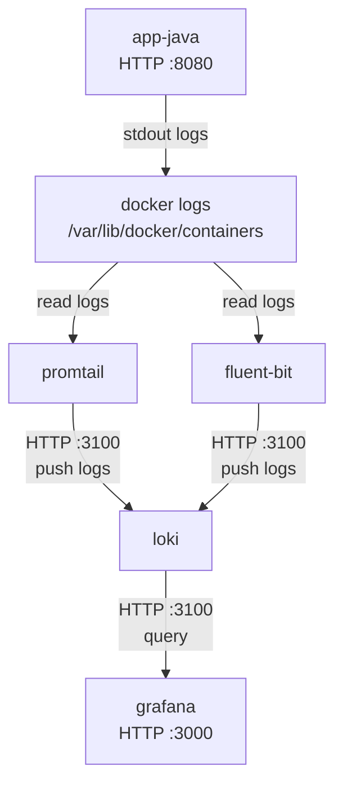

# Fase 02 – Validación del Laboratorio de Logs

## Objetivo

En esta fase capturamos logs generados por la aplicación `app-java` desde contenedores Docker y los visualizamos en **Grafana**, usando **Loki** como backend de almacenamiento.

Los logs pueden ser recolectados usando dos herramientas:

- **Promtail** (recolector nativo de Loki)
- **Fluent Bit** (router de logs más flexible)

⚠️ Solo uno debe estar activo a la vez.

---

# Arquitectura



## Tabla de puertos
| Componente        | Puerto | Tipo     | Uso                                                                                                                      |
| ----------------- | ------ | -------- | ------------------------------------------------------------------------------------------------------------------------ |
| **app-java**      | 8080   | HTTP     | Endpoint de la aplicación (`/pago`). Se utiliza para generar tráfico y producir logs.                                    |
| **Promtail**      | —      | Interno  | Promtail no expone puerto público. Lee logs directamente desde `/var/lib/docker/containers`.                             |
| **Fluent Bit**    | —      | Interno  | Fluent Bit tampoco expone puerto público. Lee logs desde archivos de Docker y los envía a Loki.                          |
| **Loki**          | 3100   | HTTP API | Endpoint de Loki para ingestión y consultas de logs. Grafana se conecta aquí para realizar búsquedas.                    |
| **Grafana**       | 3000   | HTTP     | Interfaz web para visualizar logs y explorar datos en Loki.                                                              |
| **Docker Engine** | —      | Interno  | Mantiene los archivos de logs de contenedores en `/var/lib/docker/containers`, que son leídos por Promtail o Fluent Bit. |

---

# Paso 1 – Levantar el laboratorio

Desde la carpeta de la fase:

```bash
docker compose up -d
```

Verificar que todos los contenedores estén activos:

```bash
docker ps
```

Deberías ver algo similar a:

```
app-java
loki
grafana
promtail
```

o bien:

```
app-java
loki
grafana
fluent-bit
```

---

# Paso 2 – Generar tráfico

Para que aparezcan logs en Loki necesitamos generar solicitudes hacia la aplicación.

### Linux / macOS

Ejecutar:
(asegurate de darle permisos de ejecución si estas en linux o mac)
```bash
./scripts/generar_trafico.sh
```

---

### Windows (PowerShell)

Ejecutar:

```powershell
.\scripts\generar_trafico.ps1
```

Esto enviará múltiples requests al endpoint:

```
http://localhost:8080/pago
```

y generará logs dentro del contenedor `app-java`.

---

# Paso 3 – Abrir Grafana

Abrir en el navegador:

```
http://localhost:3000
```

Credenciales por defecto:

```
usuario: admin
password: admin
```

---

# Paso 4 – Explorar logs

Dentro de Grafana:

1. Ir a **Explore**
2. Seleccionar el datasource **Loki**

En el campo de consulta ingresar:

```
{container="app-java"}
```

Deberías ver los logs generados por la aplicación.

---

# Paso 5 – Probar búsquedas

Puedes probar consultas como:

### todos los logs

```
{container="app-java"}
```

### buscar mensajes específicos

```
{container="app-java"} |= "Procesando"
```

### logs recientes

Seleccionar rango de tiempo:

```
Last 5 minutes
```

---

# Paso 6 – Verificar que el recolector funcione

Una vez generado tráfico, es importante verificar que el componente encargado de recolectar logs esté funcionando correctamente.

En este laboratorio existen dos opciones de recolector:

*  Promtail (recomendado para comenzar)
* Fluent Bit (más flexible y usado en entornos productivos)

⚠️ Solo uno debe estar activo a la vez para evitar duplicación de logs.

Si usas Promtail

Ejecutar:
```
docker compose logs promtail
```

Deberías ver mensajes indicando que Promtail está leyendo logs desde los contenedores Docker.

Ejemplo esperado:
```
level=info msg="tailing new file" filename=/var/lib/docker/containers/.../container.log
```
Si usas Fluent Bit

Ejecutar:
```
docker compose logs fluent-bit
```
Deberías ver mensajes indicando que Fluent Bit está enviando logs a Loki.

Ejemplo esperado:
```
[info] [output:loki:loki.0] sending batch to http://loki:3100
```
6.1 – Cambiar entre Promtail y Fluent Bit

El componente activo se define en el archivo:

```
docker-compose.yml
```
Ahí puedes habilitar uno y deshabilitar el otro comentando el servicio correspondiente.

Ejemplo usando Promtail:

```
services:
  promtail:
    image: grafana/promtail
    ...
```
y dejando Fluent Bit deshabilitado:

```
# fluent-bit:
#   image: fluent/fluent-bit
```

Si deseas probar Fluent Bit, puedes invertir la configuración:
```
services:
  fluent-bit:
    image: fluent/fluent-bit
```
y comentar Promtail.

Después de cambiar el recolector, reinicia el laboratorio:

```
docker compose down
docker compose up -d
Resultado esperado
```
Después de cambiar el recolector y generar tráfico nuevamente, deberías poder ver logs en Grafana usando consultas como:
```
{container="app-java"}
```
---

# Resultado esperado

Si todo está funcionando correctamente deberías poder:

✔ ver logs de `app-java` en Grafana  
✔ filtrar logs por etiquetas  
✔ buscar texto dentro de logs  
✔ observar logs generados en tiempo real  

---

# Cierre de la fase

La Fase 02 se considera completada cuando:

✔ Grafana puede consultar Loki
✔ logs de app-java aparecen en tiempo real
✔ las etiquetas permiten filtrar logs
✔ Promtail o Fluent Bit pueden recolectar logs correctamente
