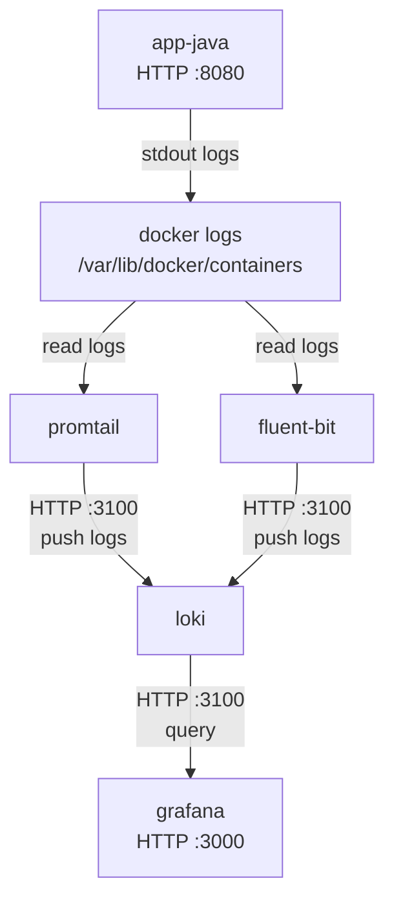

# Fase 02 – Validación del Laboratorio de Logs

## Objetivo

En esta fase capturamos logs generados por la aplicación `app-java` desde contenedores Docker y los visualizamos en **Grafana**, usando **Loki** como backend de almacenamiento.

Los logs pueden ser recolectados usando dos herramientas:

- **Promtail** (recolector nativo de Loki)
- **Fluent Bit** (router de logs más flexible)

⚠️ Solo uno debe estar activo a la vez.

---

# Arquitectura



## Tabla de puertos
| Componente        | Puerto | Tipo     | Uso                                                                                                                      |
| ----------------- | ------ | -------- | ------------------------------------------------------------------------------------------------------------------------ |
| **app-java**      | 8080   | HTTP     | Endpoint de la aplicación (`/pago`). Se utiliza para generar tráfico y producir logs.                                    |
| **Promtail**      | —      | Interno  | Promtail no expone puerto público. Lee logs directamente desde `/var/lib/docker/containers`.                             |
| **Fluent Bit**    | —      | Interno  | Fluent Bit tampoco expone puerto público. Lee logs desde archivos de Docker y los envía a Loki.                          |
| **Loki**          | 3100   | HTTP API | Endpoint de Loki para ingestión y consultas de logs. Grafana se conecta aquí para realizar búsquedas.                    |
| **Grafana**       | 3000   | HTTP     | Interfaz web para visualizar logs y explorar datos en Loki.                                                              |
| **Docker Engine** | —      | Interno  | Mantiene los archivos de logs de contenedores en `/var/lib/docker/containers`, que son leídos por Promtail o Fluent Bit. |

---

# Paso 1 – Levantar el laboratorio

Desde la carpeta de la fase:

```bash
docker compose up -d
```

Verificar que todos los contenedores estén activos:

```bash
docker ps
```

Deberías ver algo similar a:

```
app-java
loki
grafana
promtail
```

o bien:

```
app-java
loki
grafana
fluent-bit
```

---

# Paso 2 – Generar tráfico

Para que aparezcan logs en Loki necesitamos generar solicitudes hacia la aplicación.

### Linux / macOS

Ejecutar:

```bash
./scripts/generar_trafico.sh
```

---

### Windows (PowerShell)

Ejecutar:

```powershell
.\scripts\generar_trafico.ps1
```

Esto enviará múltiples requests al endpoint:

```
http://localhost:8080/pago
```

y generará logs dentro del contenedor `app-java`.

---

# Paso 3 – Abrir Grafana

Abrir en el navegador:

```
http://localhost:3000
```

Credenciales por defecto:

```
usuario: admin
password: admin
```

---

# Paso 4 – Explorar logs

Dentro de Grafana:

1. Ir a **Explore**
2. Seleccionar el datasource **Loki**

En el campo de consulta ingresar:

```
{container="app-java"}
```

Deberías ver los logs generados por la aplicación.

---

# Paso 5 – Probar búsquedas

Puedes probar consultas como:

### todos los logs

```
{container="app-java"}
```

### buscar mensajes específicos

```
{container="app-java"} |= "Procesando"
```

### logs recientes

Seleccionar rango de tiempo:

```
Last 5 minutes
```

---

# Paso 6 – Verificar que el recolector funcione

### Si usas Promtail

```bash
docker compose logs promtail
```

Deberías ver mensajes indicando lectura de logs de contenedores.

---

### Si usas Fluent Bit

```bash
docker compose logs fluent-bit
```

Deberías ver mensajes indicando envío de logs a Loki.

---

# Resultado esperado

Si todo está funcionando correctamente deberías poder:

✔ ver logs de `app-java` en Grafana  
✔ filtrar logs por etiquetas  
✔ buscar texto dentro de logs  
✔ observar logs generados en tiempo real  

---

# Script Linux/macOS

Archivo: `scripts/generar_trafico.sh`

```bash
#!/bin/bash

echo "Generando tráfico hacia app-java..."

URL="http://localhost:8080/pago"

for i in {1..20}
do
  curl -s $URL > /dev/null
  echo "request $i enviada"
  sleep 1
done

echo "Tráfico generado."
```

Dar permisos de ejecución:
```bash
chmod +x scripts/generar_trafico.sh
```

# Script Windows (PowerShell)
Archivo: scripts/generar_trafico.ps1

```bash
Write-Host "Generando tráfico hacia app-java..."

$url = "http://localhost:8080/pago"

for ($i=1; $i -le 20; $i++) {
    Invoke-WebRequest -Uri $url -Method Get | Out-Null
    Write-Host "request $i enviada"
    Start-Sleep -Seconds 1
}

Write-Host "Tráfico generado."
```
Ejecutar:
```bash
.\scripts\generar_trafico.ps1
```
# Cierre de la fase

La Fase 02 se considera completada cuando:

✔ Grafana puede consultar Loki
✔ logs de app-java aparecen en tiempo real
✔ las etiquetas permiten filtrar logs
✔ Promtail o Fluent Bit pueden recolectar logs correctamente
