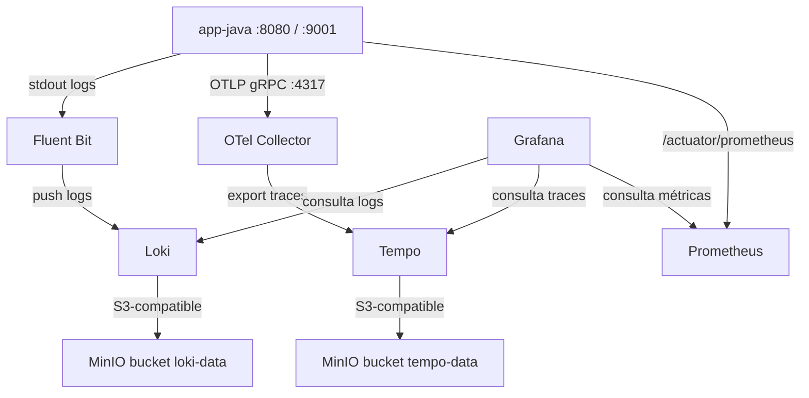

# Laboratorio de observabilidad con persistencia distribuida (Loki + Tempo + MinIO)

## Objetivo

Este laboratorio deja a **Perses fuera del alcance** (puedes ver el proyecto por separado en una carpeta al mismo nivel que la carpeta que contiene este archivo) y se concentra en la parte de **ingestión y persistencia**:

- **Logs** desde `app-java` hacia **Loki** usando **Fluent Bit**.
- **Traces** desde `app-java` hacia **Tempo** usando **OpenTelemetry Collector**.
- **Métricas** desde `app-java` hacia **Prometheus**.
- **Persistencia distribuida** para **logs y traces** usando **MinIO** como almacenamiento S3-compatible.

> En esta iteración **no se agrega Thanos**, por lo que las métricas siguen almacenadas localmente en Prometheus.

---

## Qué se corrigió respecto a la versión previa

- Se unificó la red de Docker Compose para que todos los servicios se resuelvan por nombre.
- Se reemplazó **Jaeger** por **Tempo** para la persistencia de trazas.
- Se agregó **MinIO** y un contenedor `minio-init` para crear buckets automáticamente.
- Se actualizó **Loki** para usar backend **S3-compatible** en MinIO.
- Se agregó **Prometheus** para scrapear `/actuator/prometheus` de la aplicación.
- Se corrigió `application.properties` para exponer correctamente el puerto de management y enriquecer logs con `trace_id` y `span_id`.
- Se removió la duplicidad de `spring-boot-starter-actuator` en `pom.xml`.
- Se agregaron datasources auto-provisionados en **Grafana** para Prometheus, Loki y Tempo.

---

## Arquitectura



---

## Puertos

| Componente | Puerto host | Uso |
|---|---:|---|
| app-java | 8080 | API de prueba |
| app-java management | 9001 | `/actuator/prometheus` |
| OpenTelemetry Collector | 4317 / 4318 | Recepción OTLP |
| Prometheus | 9090 | Métricas |
| Loki | 3100 | Logs |
| Tempo | 3200 | Traces |
| Grafana | 3000 | Visualización |
| MinIO API | 9000 | Object storage |
| MinIO Console | 9002 | Consola web |

---

## Levantar el laboratorio

```bash
docker compose up -d --build
```

Validar:

```bash
docker compose ps
```

---

## Generar tráfico

### Linux / macOS

```bash
./scripts/generar_trafico.sh
```

### Windows / PowerShell

```powershell
.\scripts\generar_trafico.ps1
```

También puedes disparar un error controlado:

```bash
curl -X POST http://localhost:8080/servicio/pagar \
  -H "Content-Type: application/json" \
  -d '{"idServicio":500,"monto":120.50}'
```

---

## Validaciones rápidas

### 1) Prometheus

Abrir:

```text
http://localhost:9090/targets
```

Deben aparecer `prometheus` y `app-java` en estado **UP**.

### 2) Grafana

Abrir:

```text
http://localhost:3000
```

Credenciales:

```text
admin / admin
```

Los datasources **Prometheus**, **Loki** y **Tempo** quedan provisionados automáticamente.

### 3) MinIO

Abrir la consola:

```text
http://localhost:9002
```

Credenciales:

```text
minioadmin / minioadmin123
```

Buckets esperados:

- `loki-data`
- `tempo-data`

---

## Cómo demostrar que sí hay persistencia en MinIO

### Logs

1. Genera tráfico.
2. Entra a la consola de MinIO.
3. Abre el bucket `loki-data`.
4. Debes ver objetos e índices creados por Loki.

### Traces

1. Genera tráfico a la app.
2. Espera unos segundos.
3. Entra al bucket `tempo-data`.
4. Debes ver bloques escritos por Tempo.

> Importante: **la aplicación Java no escribe a MinIO**. Quienes escriben son **Loki** y **Tempo**.

---

## Queries útiles

### Loki

```logql
{container_name="app-java"}
```

```logql
{container_name="app-java"} |= "trace_id="
```

### Prometheus

```promql
up
```

```promql
http_server_requests_seconds_count
```

### Tempo

En Grafana, abre **Explore** y usa el datasource **Tempo** para buscar trazas del servicio `app-java`.

---

## Notas

- Esta versión mantiene **Grafana** solo como ayuda para validar el stack; **Perses** queda aislado en el  otro proyecto.
- Si después quieres persistencia distribuida de métricas en MinIO, el siguiente paso natural es **Thanos**.
